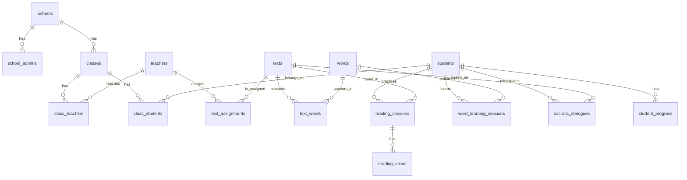

# 資料庫架構設計

> Database Schema Design for 朗朗上口
> Version 1.0 | 2026-02-13

---

## 📋 設計原則

### 1. **借鑑 Duotopia 校班師生課架構**
- ✅ 已驗證的「School → Class → Teacher/Student → Course」模型
- ✅ 多對多關係處理經驗（教師可教多個班級、學生可屬於多個班級）
- ✅ 權限管理清晰（學校管理員、教師、學生）

### 2. **朗朗上口特殊需求**
- ✅ **學習模組**：朗讀、生字詞、蘇格拉底對話
- ✅ **評估數據**：語速、準確率、錯誤分析、停頓偵測
- ✅ **學習進度**：能力雷達圖、掌握度追蹤
- ✅ **課文來源**：曾教授授權教材、教師自訂課文

### 3. **可擴展性**
- ✅ 未來可新增「聽力模組」「作文批改模組」
- ✅ 支援多種課文來源（曾教授教材、教科書、自訂）
- ✅ 支援不同年級課綱（國小 1-6 年級）

---

## 🏗️ 架構總覽

### **核心實體（Entities）**

```
學校層級（School Tier）
├── schools（學校）
└── school_admins（學校管理員）

班級層級（Class Tier）
├── classes（班級）
└── class_teachers（班級-教師關聯表）

用戶層級（User Tier）
├── teachers（教師）
├── students（學生）
└── class_students（班級-學生關聯表）

課程層級（Curriculum Tier）
├── texts（課文）
├── words（生字詞）
└── text_words（課文-生字詞關聯表）

學習模組（Learning Modules）
├── reading_sessions（朗讀練習記錄）
├── reading_errors（朗讀錯誤分析）
├── word_learning_sessions（生字詞學習記錄）
├── socratic_dialogues（蘇格拉底對話記錄）
└── student_progress（學生學習進度）

指派管理（Assignment Management）
├── text_assignments（課文指派）
└── assignment_submissions（學生完成記錄）
```

---

## 📊 ER Diagram



---

## 📝 資料表定義

### **1. 學校層級（School Tier）**

#### `schools`（學校）
```sql
CREATE TABLE schools (
  id UUID PRIMARY KEY DEFAULT gen_random_uuid(),
  name VARCHAR(100) NOT NULL,
  email_domain VARCHAR(100),  -- 學校 Email 網域（如 @school.edu.tw）
  region VARCHAR(50),          -- 縣市
  address TEXT,
  phone VARCHAR(20),
  created_at TIMESTAMP DEFAULT NOW(),
  updated_at TIMESTAMP DEFAULT NOW()
);

CREATE INDEX idx_schools_email_domain ON schools(email_domain);
```

**說明**：
- `email_domain`：用於驗證教師與學生 Email 是否屬於學校（PRD P0 功能）
- `region`：未來可做地區分析（如哪個縣市使用率最高）

---

#### `school_admins`（學校管理員）
```sql
CREATE TABLE school_admins (
  id UUID PRIMARY KEY DEFAULT gen_random_uuid(),
  school_id UUID REFERENCES schools(id) ON DELETE CASCADE,
  name VARCHAR(50) NOT NULL,
  email VARCHAR(100) UNIQUE NOT NULL,
  password_hash VARCHAR(255) NOT NULL,
  role VARCHAR(20) DEFAULT 'admin',  -- 'admin', 'super_admin'
  created_at TIMESTAMP DEFAULT NOW(),
  updated_at TIMESTAMP DEFAULT NOW()
);

CREATE INDEX idx_school_admins_school_id ON school_admins(school_id);
CREATE INDEX idx_school_admins_email ON school_admins(email);
```

---

### **2. 班級層級（Class Tier）**

#### `classes`（班級）
```sql
CREATE TABLE classes (
  id UUID PRIMARY KEY DEFAULT gen_random_uuid(),
  school_id UUID REFERENCES schools(id) ON DELETE CASCADE,
  name VARCHAR(50) NOT NULL,  -- 如「一年甲班」
  grade INT CHECK (grade BETWEEN 1 AND 6),  -- 年級（1-6）
  academic_year INT,  -- 學年度（如 2026）
  semester INT CHECK (semester IN (1, 2)),  -- 學期（1 或 2）
  created_at TIMESTAMP DEFAULT NOW(),
  updated_at TIMESTAMP DEFAULT NOW()
);

CREATE INDEX idx_classes_school_id ON classes(school_id);
CREATE INDEX idx_classes_grade ON classes(grade);
```

**說明**：
- `grade`：國小 1-6 年級，用於課文難度分級
- `academic_year` + `semester`：追蹤學習進度跨學期變化

---

#### `class_teachers`（班級-教師關聯表）
```sql
CREATE TABLE class_teachers (
  id UUID PRIMARY KEY DEFAULT gen_random_uuid(),
  class_id UUID REFERENCES classes(id) ON DELETE CASCADE,
  teacher_id UUID REFERENCES teachers(id) ON DELETE CASCADE,
  role VARCHAR(20) DEFAULT 'teacher',  -- 'teacher', 'co_teacher'
  created_at TIMESTAMP DEFAULT NOW(),
  UNIQUE(class_id, teacher_id)
);

CREATE INDEX idx_class_teachers_class_id ON class_teachers(class_id);
CREATE INDEX idx_class_teachers_teacher_id ON class_teachers(teacher_id);
```

**說明**：
- 支援多位教師教同一班（主教師 + 協同教師）
- 支援一位教師教多個班級

---

### **3. 用戶層級（User Tier）**

#### `teachers`（教師）
```sql
CREATE TABLE teachers (
  id UUID PRIMARY KEY DEFAULT gen_random_uuid(),
  school_id UUID REFERENCES schools(id) ON DELETE CASCADE,
  name VARCHAR(50) NOT NULL,
  email VARCHAR(100) UNIQUE NOT NULL,
  password_hash VARCHAR(255) NOT NULL,
  phone VARCHAR(20),
  agreed_terms BOOLEAN DEFAULT FALSE,  -- 同意使用條款（PRD P0）
  agreed_data_usage BOOLEAN DEFAULT FALSE,
  agreed_ai_analysis BOOLEAN DEFAULT FALSE,
  agreed_teaching_observation BOOLEAN DEFAULT FALSE,
  created_at TIMESTAMP DEFAULT NOW(),
  updated_at TIMESTAMP DEFAULT NOW()
);

CREATE INDEX idx_teachers_school_id ON teachers(school_id);
CREATE INDEX idx_teachers_email ON teachers(email);
```

**說明**：
- `agreed_*`：PRD 要求的 4 項同意事項（P0 功能）

---

#### `students`（學生）
```sql
CREATE TABLE students (
  id UUID PRIMARY KEY DEFAULT gen_random_uuid(),
  school_id UUID REFERENCES schools(id) ON DELETE CASCADE,
  name VARCHAR(50) NOT NULL,
  email VARCHAR(100) UNIQUE,  -- 可選（低年級可能無 Email）
  password_hash VARCHAR(255),
  student_number VARCHAR(20),  -- 學號
  grade INT CHECK (grade BETWEEN 1 AND 6),
  birth_year INT,
  created_at TIMESTAMP DEFAULT NOW(),
  updated_at TIMESTAMP DEFAULT NOW()
);

CREATE INDEX idx_students_school_id ON students(school_id);
CREATE INDEX idx_students_email ON students(email);
CREATE INDEX idx_students_student_number ON students(student_number);
```

**說明**：
- `email` 可為 NULL（低年級學生可能無 Email）
- `student_number`：學校學號，用於匯入

---

#### `class_students`（班級-學生關聯表）
```sql
CREATE TABLE class_students (
  id UUID PRIMARY KEY DEFAULT gen_random_uuid(),
  class_id UUID REFERENCES classes(id) ON DELETE CASCADE,
  student_id UUID REFERENCES students(id) ON DELETE CASCADE,
  seat_number INT,  -- 座號
  created_at TIMESTAMP DEFAULT NOW(),
  UNIQUE(class_id, student_id)
);

CREATE INDEX idx_class_students_class_id ON class_students(class_id);
CREATE INDEX idx_class_students_student_id ON class_students(student_id);
```

---

### **4. 課程層級（Curriculum Tier）**

#### `texts`（課文）
```sql
CREATE TABLE texts (
  id UUID PRIMARY KEY DEFAULT gen_random_uuid(),
  title VARCHAR(100) NOT NULL,
  content TEXT NOT NULL,
  content_with_bopomofo TEXT,  -- 附注音版本
  source VARCHAR(50),  -- 'tseng_textbook', 'teacher_custom', 'publisher'
  source_book VARCHAR(100),  -- 來源書名（如《漫畫語文故事集》）
  grade INT CHECK (grade BETWEEN 1 AND 6),
  difficulty_level INT CHECK (difficulty_level BETWEEN 1 AND 5),  -- 難度（1 最簡單）
  word_count INT,  -- 字數
  created_by UUID REFERENCES teachers(id),  -- 建立者（若為教師自訂）
  created_at TIMESTAMP DEFAULT NOW(),
  updated_at TIMESTAMP DEFAULT NOW()
);

CREATE INDEX idx_texts_grade ON texts(grade);
CREATE INDEX idx_texts_source ON texts(source);
CREATE INDEX idx_texts_difficulty_level ON texts(difficulty_level);
```

**說明**：
- `content_with_bopomofo`：PRD P0 功能（注音符號切換）
- `source`：課文來源（曾教授教材、教師自訂、出版社）
- `difficulty_level`：未來可做智能推薦（根據學生能力推薦適合難度）

---

#### `words`（生字詞）
```sql
CREATE TABLE words (
  id UUID PRIMARY KEY DEFAULT gen_random_uuid(),
  word VARCHAR(10) NOT NULL UNIQUE,  -- 生字詞（如「清」）
  bopomofo VARCHAR(20),  -- 注音（如「ㄑㄧㄥ」）
  tone INT CHECK (tone BETWEEN 1 AND 5),  -- 聲調（1-4 + 輕聲 5）
  radical VARCHAR(10),  -- 部首（如「氵」）
  strokes INT,  -- 筆畫數
  components JSONB,  -- 部件拆解（如 ["氵", "青"]）
  definition TEXT,  -- 字義
  example_sentence TEXT,  -- 例句
  stroke_order_json JSONB,  -- 筆順 JSON（來源：方大哥 9,606 字）
  created_at TIMESTAMP DEFAULT NOW(),
  updated_at TIMESTAMP DEFAULT NOW()
);

CREATE INDEX idx_words_word ON words(word);
CREATE INDEX idx_words_radical ON words(radical);
```

**說明**：
- `components`：部件教學法（曾教授教學法）
- `stroke_order_json`：方大哥 9,606 字筆順資料

---

#### `text_words`（課文-生字詞關聯表）
```sql
CREATE TABLE text_words (
  id UUID PRIMARY KEY DEFAULT gen_random_uuid(),
  text_id UUID REFERENCES texts(id) ON DELETE CASCADE,
  word_id UUID REFERENCES words(id) ON DELETE CASCADE,
  position INT,  -- 生字詞在課文中的位置
  is_new_word BOOLEAN DEFAULT TRUE,  -- 是否為新學生字
  created_at TIMESTAMP DEFAULT NOW(),
  UNIQUE(text_id, word_id)
);

CREATE INDEX idx_text_words_text_id ON text_words(text_id);
CREATE INDEX idx_text_words_word_id ON text_words(word_id);
```

---

### **5. 學習模組（Learning Modules）**

#### `reading_sessions`（朗讀練習記錄）
```sql
CREATE TABLE reading_sessions (
  id UUID PRIMARY KEY DEFAULT gen_random_uuid(),
  student_id UUID REFERENCES students(id) ON DELETE CASCADE,
  text_id UUID REFERENCES texts(id) ON DELETE CASCADE,

  -- 音訊與文本
  audio_url TEXT NOT NULL,  -- 朗讀音訊 URL（儲存於 S3/Azure Blob）
  audio_duration FLOAT,  -- 音訊時長（秒）
  transcript TEXT,  -- STT 轉錄文本

  -- 評估指標
  wer FLOAT,  -- Word Error Rate（字錯誤率）
  accuracy FLOAT,  -- 準確率（1 - WER）
  speed FLOAT,  -- 語速（字/分鐘）
  pause_count INT,  -- 停頓次數
  avg_pause_duration FLOAT,  -- 平均停頓時長（秒）

  -- 段落朗讀追蹤（PRD P0：段落 → 整篇）
  is_paragraph BOOLEAN DEFAULT FALSE,  -- 是否為段落朗讀
  paragraph_index INT,  -- 段落編號（如第 1 段）
  is_full_text BOOLEAN DEFAULT FALSE,  -- 是否為整篇朗讀

  -- AI 回饋
  ai_feedback TEXT,  -- AI 生成的回饋（如「朗讀流暢，但『學校』跳字了」）
  fluency_score INT CHECK (fluency_score BETWEEN 0 AND 100),  -- 流暢度分數

  created_at TIMESTAMP DEFAULT NOW()
);

CREATE INDEX idx_reading_sessions_student_id ON reading_sessions(student_id);
CREATE INDEX idx_reading_sessions_text_id ON reading_sessions(text_id);
CREATE INDEX idx_reading_sessions_created_at ON reading_sessions(created_at DESC);
```

**說明**：
- `is_paragraph` + `paragraph_index`：PRD P0 功能（段落 → 整篇）
- `wer`, `accuracy`, `speed`：核心評估指標
- `ai_feedback`：GPT-4o 生成的個人化回饋

---

#### `reading_errors`（朗讀錯誤分析）
```sql
CREATE TABLE reading_errors (
  id UUID PRIMARY KEY DEFAULT gen_random_uuid(),
  session_id UUID REFERENCES reading_sessions(id) ON DELETE CASCADE,

  error_type VARCHAR(20) CHECK (error_type IN ('skip', 'insert', 'substitute')),
  position INT,  -- 錯誤位置（第幾個字）
  expected_word VARCHAR(10),  -- 應該讀的字
  actual_word VARCHAR(10),  -- 實際讀的字（NULL 表示跳字）

  created_at TIMESTAMP DEFAULT NOW()
);

CREATE INDEX idx_reading_errors_session_id ON reading_errors(session_id);
CREATE INDEX idx_reading_errors_error_type ON reading_errors(error_type);
```

**說明**：
- `error_type`：
  - `skip`：跳字（應該讀「學校」但跳過了）
  - `insert`：加字（多讀了一個字）
  - `substitute`：讀錯（把「清」讀成「請」）

---

#### `word_learning_sessions`（生字詞學習記錄）
```sql
CREATE TABLE word_learning_sessions (
  id UUID PRIMARY KEY DEFAULT gen_random_uuid(),
  student_id UUID REFERENCES students(id) ON DELETE CASCADE,
  word_id UUID REFERENCES words(id) ON DELETE CASCADE,

  -- 學習活動
  activity_type VARCHAR(20) CHECK (activity_type IN ('view', 'write', 'quiz')),
  -- 'view': 查看生字詞（部件拆解、例句）
  -- 'write': 筆順練習
  -- 'quiz': 生字測驗

  -- 測驗結果（若為 quiz）
  quiz_score INT CHECK (quiz_score BETWEEN 0 AND 100),

  created_at TIMESTAMP DEFAULT NOW()
);

CREATE INDEX idx_word_learning_sessions_student_id ON word_learning_sessions(student_id);
CREATE INDEX idx_word_learning_sessions_word_id ON word_learning_sessions(word_id);
```

---

#### `socratic_dialogues`（蘇格拉底對話記錄）
```sql
CREATE TABLE socratic_dialogues (
  id UUID PRIMARY KEY DEFAULT gen_random_uuid(),
  student_id UUID REFERENCES students(id) ON DELETE CASCADE,
  text_id UUID REFERENCES texts(id) ON DELETE CASCADE,

  -- 對話記錄
  conversation JSONB NOT NULL,  -- 完整對話（問題與回答）
  -- 格式：[{"role": "ai", "content": "這篇課文在說什麼？"}, {"role": "student", "content": "在說小明去學校"}]

  -- 評估
  comprehension_score INT CHECK (comprehension_score BETWEEN 0 AND 100),
  turn_count INT,  -- 對話回合數

  created_at TIMESTAMP DEFAULT NOW()
);

CREATE INDEX idx_socratic_dialogues_student_id ON socratic_dialogues(student_id);
CREATE INDEX idx_socratic_dialogues_text_id ON socratic_dialogues(text_id);
```

**說明**：
- Phase 3 功能（蘇格拉底對話）
- `conversation` JSONB：儲存完整對話歷史

---

#### `student_progress`（學生學習進度）
```sql
CREATE TABLE student_progress (
  id UUID PRIMARY KEY DEFAULT gen_random_uuid(),
  student_id UUID REFERENCES students(id) ON DELETE CASCADE,

  -- 能力指標（能力雷達圖）
  reading_fluency_score INT CHECK (reading_fluency_score BETWEEN 0 AND 100),
  reading_accuracy_score INT CHECK (reading_accuracy_score BETWEEN 0 AND 100),
  reading_speed_score INT CHECK (reading_speed_score BETWEEN 0 AND 100),
  comprehension_score INT CHECK (comprehension_score BETWEEN 0 AND 100),
  word_mastery_score INT CHECK (word_mastery_score BETWEEN 0 AND 100),

  -- 統計數據
  total_reading_sessions INT DEFAULT 0,
  total_practice_minutes INT DEFAULT 0,
  words_learned INT DEFAULT 0,

  -- 最後練習時間
  last_practice_at TIMESTAMP,

  updated_at TIMESTAMP DEFAULT NOW()
);

CREATE UNIQUE INDEX idx_student_progress_student_id ON student_progress(student_id);
CREATE INDEX idx_student_progress_last_practice_at ON student_progress(last_practice_at);
```

**說明**：
- 學生的「能力雷達圖」數據
- 每次朗讀/學習後更新
- `last_practice_at`：用於「早期介入」預警（超過 7 天未練習發送通知）

---

### **6. 指派管理（Assignment Management）**

#### `text_assignments`（課文指派）
```sql
CREATE TABLE text_assignments (
  id UUID PRIMARY KEY DEFAULT gen_random_uuid(),
  teacher_id UUID REFERENCES teachers(id) ON DELETE CASCADE,
  class_id UUID REFERENCES classes(id) ON DELETE CASCADE,
  text_id UUID REFERENCES texts(id) ON DELETE CASCADE,

  title VARCHAR(100),  -- 作業標題（如「第三課朗讀練習」）
  instructions TEXT,  -- 作業說明
  due_date TIMESTAMP,  -- 截止日期

  -- 要求
  required_accuracy FLOAT DEFAULT 0.90,  -- 要求準確率（預設 90%）
  required_speed FLOAT,  -- 要求語速（字/分鐘，可選）

  created_at TIMESTAMP DEFAULT NOW(),
  updated_at TIMESTAMP DEFAULT NOW()
);

CREATE INDEX idx_text_assignments_teacher_id ON text_assignments(teacher_id);
CREATE INDEX idx_text_assignments_class_id ON text_assignments(class_id);
CREATE INDEX idx_text_assignments_text_id ON text_assignments(text_id);
CREATE INDEX idx_text_assignments_due_date ON text_assignments(due_date);
```

---

#### `assignment_submissions`（學生完成記錄）
```sql
CREATE TABLE assignment_submissions (
  id UUID PRIMARY KEY DEFAULT gen_random_uuid(),
  assignment_id UUID REFERENCES text_assignments(id) ON DELETE CASCADE,
  student_id UUID REFERENCES students(id) ON DELETE CASCADE,
  reading_session_id UUID REFERENCES reading_sessions(id) ON DELETE SET NULL,

  -- 完成狀態
  status VARCHAR(20) CHECK (status IN ('not_started', 'in_progress', 'completed', 'passed')),
  -- 'not_started': 尚未開始
  -- 'in_progress': 進行中（已練習但未達標）
  -- 'completed': 已完成（已提交）
  -- 'passed': 已通過（達到要求準確率）

  submitted_at TIMESTAMP,
  passed_at TIMESTAMP,

  created_at TIMESTAMP DEFAULT NOW(),
  updated_at TIMESTAMP DEFAULT NOW(),
  UNIQUE(assignment_id, student_id)
);

CREATE INDEX idx_assignment_submissions_assignment_id ON assignment_submissions(assignment_id);
CREATE INDEX idx_assignment_submissions_student_id ON assignment_submissions(student_id);
CREATE INDEX idx_assignment_submissions_status ON assignment_submissions(status);
```

---

## 🔗 資料關聯說明

### **1. 校班師生課（Core Hierarchy）**

```
School (學校)
  ├─> Classes (班級)
  │     ├─> class_teachers (教師)
  │     └─> class_students (學生)
  │
  ├─> Teachers (教師)
  └─> Students (學生)
```

**多對多關係**：
- 一位教師可教多個班級（`class_teachers`）
- 一個班級可有多位教師（主教師 + 協同教師）
- 一位學生可屬於多個班級（跨班選修，但通常是一對一）

---

### **2. 課文與生字詞（Curriculum）**

```
Text (課文)
  └─> text_words (生字詞)
        └─> Words (生字詞詳細資訊)
```

**關聯邏輯**：
- 一篇課文包含多個生字詞
- 一個生字詞可出現在多篇課文

---

### **3. 學習模組（Learning Flow）**

```
Student (學生)
  ├─> reading_sessions (朗讀練習)
  │     ├─> reading_errors (錯誤分析)
  │     └─> Text (課文)
  │
  ├─> word_learning_sessions (生字詞學習)
  │     └─> Words (生字詞)
  │
  ├─> socratic_dialogues (蘇格拉底對話)
  │     └─> Text (課文)
  │
  └─> student_progress (學習進度)
```

**關聯邏輯**：
- 學生朗讀課文 → 產生 `reading_session`
- 朗讀錯誤 → 產生 `reading_errors`（多筆）
- 針對錯字學習 → 產生 `word_learning_sessions`
- 蘇格拉底對話 → 產生 `socratic_dialogues`
- 所有學習活動 → 更新 `student_progress`

---

### **4. 指派與完成（Assignment Flow）**

```
Teacher (教師)
  └─> text_assignments (指派課文給班級)
        └─> assignment_submissions (學生完成狀態)
              └─> reading_sessions (朗讀記錄)
```

**關聯邏輯**：
- 教師指派課文給班級 → 產生 `text_assignment`
- 班級所有學生自動產生 `assignment_submissions`（狀態：`not_started`）
- 學生朗讀 → 更新 `assignment_submissions.status`
- 達標 → 狀態變為 `passed`

---

## 🎯 關鍵查詢場景

### **場景 1：教師查看全班朗讀進度**

```sql
SELECT
  s.name AS student_name,
  asub.status,
  rs.accuracy,
  rs.speed,
  rs.fluency_score,
  rs.created_at AS last_practice
FROM assignment_submissions asub
JOIN students s ON asub.student_id = s.id
LEFT JOIN reading_sessions rs ON asub.reading_session_id = rs.id
WHERE asub.assignment_id = :assignment_id
ORDER BY asub.status, s.name;
```

---

### **場景 2：學生查看自己的朗讀進步曲線**

```sql
SELECT
  created_at,
  accuracy,
  speed,
  fluency_score
FROM reading_sessions
WHERE student_id = :student_id
  AND text_id = :text_id
ORDER BY created_at ASC;
```

---

### **場景 3：找出需要早期介入的學生**

```sql
SELECT
  s.id,
  s.name,
  sp.last_practice_at,
  sp.reading_fluency_score
FROM students s
JOIN student_progress sp ON s.id = sp.student_id
WHERE sp.last_practice_at < NOW() - INTERVAL '7 days'
   OR sp.reading_fluency_score < 60
ORDER BY sp.last_practice_at ASC;
```

**說明**：曾教授「早期介入」原則

---

### **場景 4：統計學生最常讀錯的字**

```sql
SELECT
  re.expected_word,
  COUNT(*) AS error_count,
  w.definition,
  w.components
FROM reading_errors re
JOIN words w ON re.expected_word = w.word
WHERE re.session_id IN (
  SELECT id FROM reading_sessions WHERE student_id = :student_id
)
GROUP BY re.expected_word, w.definition, w.components
ORDER BY error_count DESC
LIMIT 10;
```

**用途**：「針對性練習」（只練錯的字）

---

## 📈 索引策略

### **高頻查詢索引**
```sql
-- 教師查看班級學生
CREATE INDEX idx_class_students_class_id ON class_students(class_id);

-- 學生查看自己的朗讀記錄
CREATE INDEX idx_reading_sessions_student_id ON reading_sessions(student_id);
CREATE INDEX idx_reading_sessions_created_at ON reading_sessions(created_at DESC);

-- 查詢作業完成狀態
CREATE INDEX idx_assignment_submissions_assignment_id ON assignment_submissions(assignment_id);
CREATE INDEX idx_assignment_submissions_status ON assignment_submissions(status);

-- 早期介入預警
CREATE INDEX idx_student_progress_last_practice_at ON student_progress(last_practice_at);
```

### **全文搜尋索引**
```sql
-- 課文搜尋
CREATE INDEX idx_texts_title_gin ON texts USING GIN(to_tsvector('chinese', title));
CREATE INDEX idx_texts_content_gin ON texts USING GIN(to_tsvector('chinese', content));

-- 生字詞搜尋
CREATE INDEX idx_words_word_gin ON words USING GIN(to_tsvector('chinese', word));
```

---

## 🔐 權限控制

### **Row-Level Security (RLS)**

```sql
-- 教師只能查看自己教的班級學生
ALTER TABLE students ENABLE ROW LEVEL SECURITY;

CREATE POLICY teacher_view_own_students ON students
  FOR SELECT
  USING (
    school_id IN (
      SELECT school_id FROM teachers WHERE id = current_user_id()
    )
    AND id IN (
      SELECT student_id FROM class_students
      WHERE class_id IN (
        SELECT class_id FROM class_teachers WHERE teacher_id = current_user_id()
      )
    )
  );

-- 學生只能查看自己的朗讀記錄
ALTER TABLE reading_sessions ENABLE ROW LEVEL SECURITY;

CREATE POLICY student_view_own_sessions ON reading_sessions
  FOR SELECT
  USING (student_id = current_user_id());
```

---

## 🚀 未來擴展

### **Phase 4+ 功能**

#### 1. **聽力模組**
```sql
CREATE TABLE listening_sessions (
  id UUID PRIMARY KEY,
  student_id UUID REFERENCES students(id),
  audio_url TEXT,  -- 聽力題目音訊
  question TEXT,
  student_answer TEXT,
  correct_answer TEXT,
  is_correct BOOLEAN,
  created_at TIMESTAMP
);
```

#### 2. **作文批改模組**
```sql
CREATE TABLE essay_submissions (
  id UUID PRIMARY KEY,
  student_id UUID REFERENCES students(id),
  topic VARCHAR(100),
  content TEXT,
  ai_feedback JSONB,  -- GPT-4o 批改回饋
  grammar_score INT,
  content_score INT,
  structure_score INT,
  created_at TIMESTAMP
);
```

#### 3. **家長儀表板**
```sql
CREATE TABLE parent_student_relations (
  id UUID PRIMARY KEY,
  parent_email VARCHAR(100),
  student_id UUID REFERENCES students(id),
  relation VARCHAR(20),  -- 'father', 'mother', 'guardian'
  created_at TIMESTAMP
);
```

---

## 📊 資料量估算

### **假設**：
- 學校：100 所
- 每校平均：20 個班級
- 每班平均：25 位學生
- 總學生數：100 × 20 × 25 = **50,000 位**

### **儲存估算**：

| 表格 | 估算筆數 | 平均大小 | 總容量 |
|------|---------|---------|--------|
| `students` | 50,000 | 1 KB | 50 MB |
| `reading_sessions` | 50,000 × 100 次/年 | 2 KB | 1 GB |
| `reading_errors` | 5,000,000 × 5 錯誤/次 | 0.2 KB | 5 GB |
| `word_learning_sessions` | 50,000 × 200 字/年 | 0.5 KB | 5 GB |
| `texts` | 10,000 | 10 KB | 100 MB |
| `words` | 10,000 | 5 KB | 50 MB |

**總計**：約 **11.2 GB / 年**（不含音訊）

**音訊儲存**（S3/Azure Blob）：
- 每次朗讀 1 分鐘 ≈ 1 MB
- 50,000 學生 × 100 次/年 = 5,000,000 次
- **總容量**：5 TB / 年

**成本估算**（AWS S3）：
- $0.023 / GB / 月
- 5,000 GB × $0.023 ≈ **$115 / 月**

---

## ✅ 檢查清單

開發前確認：

- [ ] ER Diagram 是否清楚（已用 Mermaid 繪製）
- [ ] 主鍵全部使用 UUID（已確認）
- [ ] 外鍵關聯正確（已確認）
- [ ] 索引策略合理（已設計）
- [ ] 權限控制考慮（已設計 RLS）
- [ ] 未來擴展性（已規劃 Phase 4+）
- [ ] 資料量估算（已完成）

---

**文件維護**：
- **建立日期**：2026-02-13
- **維護者**：Young Tsai
- **最後更新**：2026-02-13
- **下次更新**：Schema 實作完成後

**參考資料**：
- Duotopia 校班師生課架構
- PRD.md（朗朗上口需求）
- EXECUTION_STRATEGY.md（技術選型）
