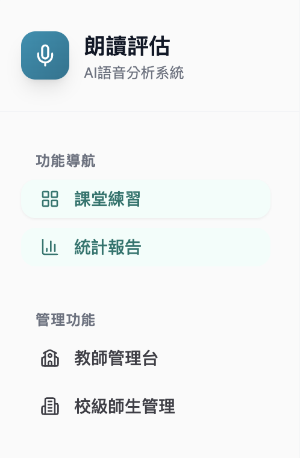
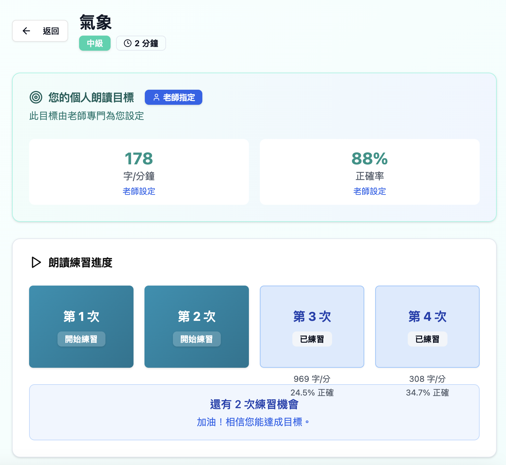
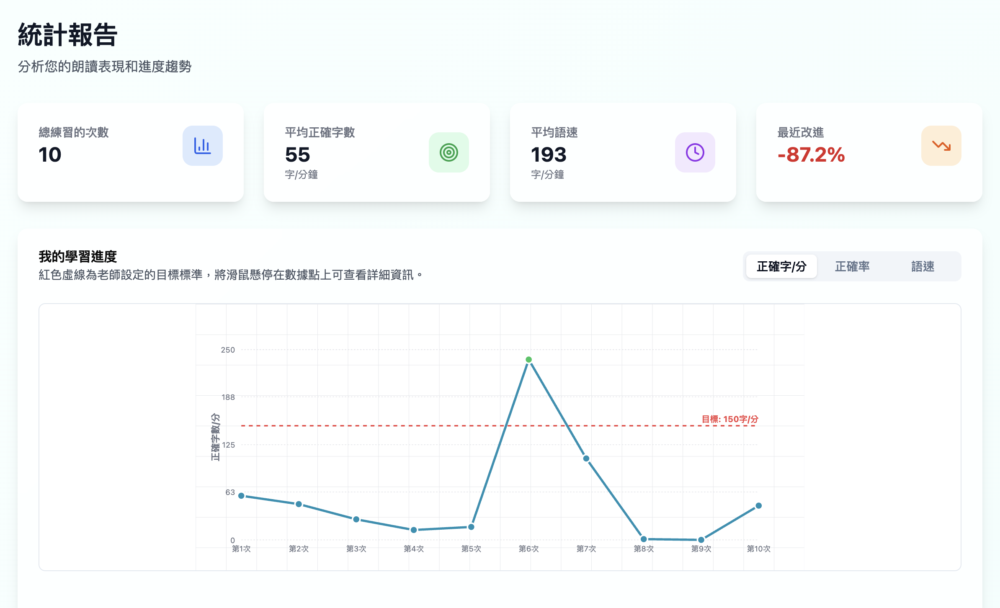

# 朗朗上口 - 產品介紹

> AI語音分析系統：國語文閱讀流暢度評估平台

*圖：朗朗上口系統側邊欄 - 功能導航與管理介面*

---

## ⚠️ 專案狀態說明

**朗朗上口**是約一年半前（2024 年中）開發的專案，目前已停止維護。

### 為何使用截圖示意？

雖然專案仍可透過網址 https://-ad028405.base44.app/ 訪問，但由於以下原因，本文檔使用截圖說明功能：

1. **後端未完成**：部分後端 API 與資料處理邏輯尚未完全實作
2. **AI SDK 過時**：語音識別與分析使用的 SDK 版本落後，與現行 API 不相容
3. **缺乏維護**：過去一年半未更新，部分功能可能無法正常運作
4. **僅供參考**：本專案主要作為技術驗證與架構參考，而非可直接使用的產品

### 專案價值

儘管未完成，「朗朗上口」仍具有重要參考價值：

- ✅ **架構驗證**：獲得曾世杰教授對系統架構與可行性的肯定
- ✅ **功能設計**：證明 AI 語音分析在中文朗讀教學的應用潛力
- ✅ **技術探索**：驗證 Base44 No-code 平台在教育專案的適用性
- ✅ **經驗傳承**：為新的「中文閱讀學習平台」提供寶貴經驗

---

## 📱 產品概覽

**朗朗上口**是一個基於 AI 技術的國語文朗讀流暢度分析系統，由 Young Tsai 與曾世杰教授共同開發。系統採用 **Base44 No-code 平台**快速建構，已驗證技術可行性並獲得曾世杰教授的肯定。

### 核心價值主張

**利用 AI 技術自動化分析學生的國語文朗讀表現，協助教師精準掌握每位學生的閱讀流暢度，實現個別化教學。**

---

## 🎯 產品功能架構

根據側邊欄導航，系統分為兩大區塊：

### 一、功能導航（學生/教學端）

#### 1. 📚 課堂練習
**目的**：學生朗讀訓練與即時分析

*圖：課堂練習詳細介面 - 以「氣象」課文為例*

**核心功能特色**：

##### 🎯 個別化目標設定
- **教師指定目標**：每位學生可有專屬的朗讀目標
  - 流暢度目標：178 字/分鐘（可調整）
  - 準確度目標：88% 正確率（可調整）
- **符合閱讀科學**：同時重視「速度」與「準確度」

##### 📝 課文資訊
- 課文名稱：氣象
- 難度標示：中級
- 預計時長：2 分鐘
- 清楚的難度分級幫助學生選擇合適課文

##### 🔄 多次練習機制
系統允許每篇課文練習 **4 次**，鼓勵反覆練習：

| 練習次數 | 狀態 | 說明 |
|---------|------|------|
| 第 1 次 | 🟢 可練習 | 開始練習按鈕（藍綠色） |
| 第 2 次 | 🟢 可練習 | 開始練習按鈕（藍綠色） |
| 第 3 次 | ✅ 已練習 | 969 字/分，24.5% 正確 |
| 第 4 次 | ✅ 已練習 | 308 字/分，34.7% 正確 |

**設計理念**：
- 學生可以看到自己每次的進步或退步
- 不限制練習次數（4 次是建議，可能可以更多）
- 提供「還有 2 次練習機會」的即時提示

##### 💬 正向鼓勵
- 「加油！相信您能達成目標。」
- 清楚顯示剩餘練習機會
- 降低學習焦慮，提升動機

##### 📊 即時數據反饋
每次練習後立即顯示：
- **流暢度**：每分鐘朗讀字數（字/分）
- **準確度**：正確率百分比
- 與教師設定目標的對比

**教學價值**：
- ✅ **個別化教學**：每個學生有不同目標，因材施教
- ✅ **反覆練習**：4 次機會鼓勵學生不斷改進
- ✅ **即時反饋**：學生立即知道表現，無需等待教師批改
- ✅ **數據驅動**：客觀的數字幫助學生理解自己的進步
- ✅ **降低教師負擔**：系統自動分析，教師只需查看結果

#### 2. 📊 統計報告
**目的**：學習成效追蹤與數據視覺化

*圖：統計報告介面 - 多維度學習分析儀表板*

**核心功能特色**：

##### 📊 關鍵指標卡片（Dashboard）

系統提供 4 個關鍵績效指標（KPI），一目了然：

| 指標 | 數值 | 說明 | 圖示 |
|------|------|------|------|
| **總練習的次數** | 10 | 累積練習次數 | 📊 柱狀圖 |
| **平均正確字數** | 55 字/分 | 平均每分鐘正確朗讀字數 | 🎯 目標 |
| **平均語速** | 193 字/分 | 平均朗讀速度 | ⏱️ 時鐘 |
| **最近改進** | -87.2% | 最近一次相比前次的進步幅度 | 📈 趨勢（紅色表示退步） |

**設計亮點**：
- 使用不同顏色與圖示區分指標類型
- 正負值清楚標示進步/退步（綠色/紅色）
- 卡片式設計，資訊密度適中

##### 📈 學習進度趨勢圖

**Y 軸**：每分鐘正確字數（核心指標）
**X 軸**：練習次數（第 1 次到第 10 次）
**紅色虛線**：教師設定的目標值（150 字/分）
**藍色實線**：學生實際表現軌跡

**真實數據案例分析**（從截圖中觀察）：

| 練習次數 | 表現 | 分析 |
|---------|------|------|
| 第 1-5 次 | 在目標以下（約 30-60 字/分） | 初期摸索階段，表現不穩定 |
| 第 6 次 | **突破！** 達到 ~250 字/分 | 超越目標，可能因熟悉課文而突飛猛進 |
| 第 7-9 次 | 下降到約 120 字/分 | 可能換了新課文或難度增加 |
| 第 10 次 | 回升到約 60 字/分 | 逐漸適應，持續進步 |

**教學價值**：
- ✅ **可視化進步軌跡**：學生清楚看到自己的學習曲線
- ✅ **目標對比**：紅色虛線提供明確的努力方向
- ✅ **識別學習模式**：教師可以看出學生是持續進步、停滯或波動
- ✅ **即時調整策略**：若多次低於目標，可能需要降低難度或加強練習

##### 🔄 多維度指標切換

右上角提供三個切換標籤：

1. **正確字/分** - 預設顯示，最核心的指標
2. **正確率** - 朗讀準確度百分比
3. **語速** - 朗讀速度（字/分鐘）

**設計理念**：
- 不同教學目標側重不同指標
- 流暢度不只看速度，更要看準確度
- 符合閱讀科學「速度與準確度並重」的原則

##### 💡 個別化目標提示

「紅色虛線為老師設定的目標標準，將滑鼠停在數據點上可查看詳細資訊。」

**互動設計**：
- Hover 顯示詳細數值
- 紅色虛線始終可見，讓學生記得目標
- 教師可為每個學生設定不同目標

---

**教學價值總結**：
- ✅ **數據驅動學習**：客觀數字取代主觀感覺
- ✅ **視覺化激勵**：看見進步曲線提升學習動機
- ✅ **個別化目標**：每個學生有不同的紅色虛線
- ✅ **多維度分析**：流暢度、準確度、語速三管齊下
- ✅ **長期追蹤**：可以看到 10 次以上的練習軌跡
- ✅ **教師洞察**：快速識別需要介入的學生（持續低於目標線）

---

### 二、管理功能（管理端）

#### 3. 🏫 教師管理台
**目的**：教師的班級管理與學習監控

**推測功能**：
- 查看所有學生的朗讀紀錄
- 比對班級整體表現
- 設定朗讀作業
- 標註需要特別關注的學生
- 匯出報告

**管理價值**：
- 一站式掌握全班學習狀況
- 快速識別需要補救教學的學生
- 減少人工批改與紀錄的負擔

#### 4. 📋 校級師生管理
**目的**：學校層級的帳號與權限管理

**推測功能**：
- 建立教師帳號
- 建立學生帳號
- 分配班級與教師
- 設定不同權限層級（管理員、教師、學生）
- 查看全校使用統計

**管理價值**：
- 支援多班級、多教師的大規模部署
- 校級資料統一管理
- 確保資料安全與隱私

---

## 🏗️ 技術架構

### 開發平台：Base44 No-code

**Base44** 是一個 No-code / Low-code 應用開發平台，特點包括：

#### ✅ 優勢

1. **快速開發**
   - 拖拉式介面設計
   - 內建常用功能模組
   - 縮短 MVP 開發時間至數週而非數月

2. **易於維護**
   - 視覺化的邏輯編輯
   - 不需要深厚的程式背景
   - 快速迭代與調整功能

3. **成本效益**
   - 降低開發人力需求
   - 減少技術債務
   - 適合預算有限的教育專案

4. **整合性**
   - 支援 API 串接
   - 可整合 AI 服務（語音識別、分析）
   - 資料庫自動管理

#### ⚠️ 限制與考量

1. **客製化程度**
   - 高度客製化功能可能受限
   - 複雜的演算法可能需要額外開發
   - UI/UX 設計彈性較低

2. **平台依賴性**
   - 綁定 Base44 生態系
   - 未來遷移可能有困難
   - 需考慮平台持續性與穩定性

3. **效能極限**
   - 大量並發使用者時的效能
   - 語音檔案處理速度
   - 資料庫查詢效率

4. **擴展性**
   - 未來若需要複雜功能（如蘇格拉底對話、手寫辨識）可能需要跳出平台

---

## 🔍 AI 語音分析技術

### 核心技術組成

#### 1. 語音識別 (STT - Speech-to-Text)
- 將學生朗讀錄音轉為文字
- 可能使用的技術：Google Speech-to-Text / Azure Speech / 其他 API

#### 2. 文本比對
- 將識別文字與原課文比對
- 偵測錯誤類型：
  - 讀錯（形近字、音近字）
  - 跳字
  - 多字
  - 重複

#### 3. 流暢度分析
- 朗讀速度（每分鐘字數）
- 停頓頻率與時長
- 語調自然度
- 整體流暢度評分

#### 4. 數據分析與報告
- 歷史紀錄比對
- 進步曲線生成
- 弱點識別
- 學習建議生成

---

## 💡 已驗證的成果

### 曾世杰教授的肯定

根據開發者描述，「朗朗上口」的架構與可行性已獲得曾世杰教授認可，這代表：

1. ✅ **教學理論驗證**
   - 流暢度分析的指標設計符合閱讀科學
   - 評估方式能夠有效反映學生的真實能力
   - 報告呈現方式對教師有實際幫助

2. ✅ **技術可行性驗證**
   - AI 語音識別在中文朗讀上的準確度可接受
   - 系統架構能夠支援實際教學場景
   - 使用者體驗設計合理

3. ✅ **實用性驗證**
   - 能夠減輕教師負擔
   - 學生能夠獨立操作
   - 數據具有教學參考價值

---

## 🔄 對新項目的意義

### 「朗朗上口」vs「中文閱讀學習平台」

| 面向 | 朗朗上口 | 新平台（規劃） |
|------|---------|--------------|
| **核心功能** | ✅ 朗讀流暢度分析 | ✅ 保留並強化 |
| **管理系統** | ✅ 教師管理台、校級管理 | ✅ 延續架構 |
| **統計報告** | ✅ 數據視覺化 | ✅ 強化分析維度 |
| **生字學習** | ❓ 未知 | ⭐ 新增（字型/字音/字義/筆順） |
| **理解評估** | ❓ 未知 | ⭐ 新增（蘇格拉底對話） |
| **智能偵錯** | ❓ 部分？ | ⭐ 強化（逐字比對、錯誤分類） |
| **課文管理** | ❓ 未知 | ⭐ 新增（著作權管理） |
| **注音輔助** | ❓ 未知 | ⭐ 新增（可開關顯示） |

### 可直接延續的部分

1. ✅ **朗讀錄音與分析流程** - 已驗證可行
2. ✅ **教師管理台架構** - 已有基礎框架
3. ✅ **統計報告設計** - 可作為參考範本
4. ✅ **校級管理系統** - 符合新平台需求

### 需要新增/強化的部分

1. ⭐ **生字學習模組** - 全新功能，需獨立開發
2. ⭐ **蘇格拉底對話系統** - 需要更進階的 NLP 技術
3. ⭐ **課文著作權管理** - 法律與技術雙重考量
4. ⭐ **學習路徑規劃** - 根據卡點自動推薦學習內容

---

## 🤔 技術選型建議

### 選項一：延續 Base44 平台

#### 適合情境
- ✅ 快速驗證 MVP
- ✅ 預算有限
- ✅ 開發團隊經驗不足
- ✅ 核心功能與「朗朗上口」相似度高

#### 風險評估
- ⚠️ 新功能（生字學習、蘇格拉底對話）的技術可行性需驗證
- ⚠️ Base44 是否支援手寫辨識、進階 NLP 整合
- ⚠️ 長期擴展性考量

### 選項二：部分採用 + 客製開發

#### 適合情境
- ✅ 朗讀分析功能延續 Base44
- ✅ 新功能（生字、對話）用 Flutter / React 客製開發
- ✅ 透過 API 整合兩者

#### 優勢
- 既保留已驗證的功能
- 又能靈活實現新需求
- 降低重新開發的風險

#### 挑戰
- 需要更多開發資源
- 系統整合複雜度提高

### 選項三：全新開發

#### 適合情境
- ✅ 預期功能遠超「朗朗上口」
- ✅ 需要高度客製化
- ✅ 有足夠的開發資源與時間
- ✅ 避免平台鎖定

#### 優勢
- 完全掌控技術棧
- 長期擴展性最佳
- UI/UX 自由度最高

#### 挑戰
- 開發時程長
- 需要更強的技術團隊
- 初期成本高

---

## 📊 技術決策矩陣

| 評估面向 | Base44 延續 | 混合方案 | 全新開發 |
|---------|-----------|---------|---------|
| **開發速度** | ⭐⭐⭐⭐⭐ | ⭐⭐⭐ | ⭐⭐ |
| **成本** | ⭐⭐⭐⭐⭐ | ⭐⭐⭐ | ⭐⭐ |
| **擴展性** | ⭐⭐ | ⭐⭐⭐ | ⭐⭐⭐⭐⭐ |
| **客製化** | ⭐⭐ | ⭐⭐⭐⭐ | ⭐⭐⭐⭐⭐ |
| **風險控制** | ⭐⭐⭐⭐ | ⭐⭐⭐ | ⭐⭐ |
| **技術債務** | ⭐⭐ | ⭐⭐⭐ | ⭐⭐⭐⭐⭐ |

---

## 💼 給方大哥的建議

### 短期策略（MVP 階段，3-6 個月）

**建議：延續 Base44 平台**

#### 理由
1. **已驗證可行**：「朗朗上口」的架構已獲您認可
2. **快速上線**：盡快讓實際師生使用，收集回饋
3. **降低風險**：兩位高三學生每週 8-10 小時，適合 No-code 開發
4. **聚焦價值**：優先實現核心功能（朗讀分析、教師管理）

#### MVP 功能建議
- ✅ 朗讀錄音與流暢度分析（延續「朗朗上口」）
- ✅ 教師管理台（延續「朗朗上口」）
- ✅ 簡化版生字學習（文字介面，暫不做手寫）
- ⏸️ 蘇格拉底對話（Phase 2 再做）
- ⏸️ 手寫辨識（Phase 2 再做）

### 中期策略（6-12 個月）

**建議：混合方案**

當 MVP 驗證成功，使用者回饋正面後：

1. **保留 Base44 核心**：朗讀分析、教師管理繼續使用
2. **客製開發新功能**：
   - 用 Flutter 開發生字學習模組（支援手寫）
   - 用 LLM API 開發蘇格拉底對話系統
3. **API 整合**：Base44 與客製模組透過 API 串接

### 長期策略（1 年後）

**評估全新開發的可能性**

若平台使用者超過 100 所學校，或需要以下功能：
- 多語言支援（閩南語、客語、英語）
- 進階學習分析（AI 個人化學習路徑）
- 大規模並發處理
- 白牌授權給其他機構

則建議投入資源進行全新開發，避免平台限制。

---

## 🎯 行動建議

### 立即行動（本週）

1. **確認 Base44 功能範圍**
   - [ ] 聯繫 Base44 技術支援，確認是否支援：
     - 語音檔案上傳與處理
     - 第三方 AI API 整合（Google Speech-to-Text 等）
     - 手寫辨識 API 整合
     - LLM API 整合（ChatGPT / Claude）

2. **取得「朗朗上口」存取權**
   - [ ] 讓啟翔、張靖杭實際試用「朗朗上口」
   - [ ] 記錄現有功能與流程
   - [ ] 識別可重用的模組

3. **定義 MVP 範圍**
   - [ ] 與曾老師對齊優先功能
   - [ ] 評估開發時程（以每週 16-20 小時估算）

### 第一個月

4. **建立開發環境**
   - [ ] Base44 專案初始化
   - [ ] GitHub 倉庫設定
   - [ ] 開發流程建立（Code Review、測試）

5. **複製核心功能**
   - [ ] 朗讀錄音介面
   - [ ] 語音識別整合
   - [ ] 基本報告頁面

### 第二至三個月

6. **新增教師管理功能**
   - [ ] 課文上傳
   - [ ] 班級與學生管理
   - [ ] 使用同意書

7. **Beta 測試**
   - [ ] 與曾老師合作學校進行小規模測試
   - [ ] 收集回饋並快速迭代

---

## 📝 結論

「朗朗上口」為新的「中文閱讀學習平台」提供了寶貴的技術驗證與架構參考。**延續 Base44 No-code 平台**是一個合理的起點，能夠在有限的資源與時間內快速交付 MVP。

隨著平台驗證成功，再逐步引入客製開發，最終視規模決定是否全面重構。這種漸進式策略能夠**平衡速度、成本與風險**，符合「三不原則」：

- ✅ **不難** - 延續已驗證技術
- ✅ **可規模化** - 校級管理支援多校部署
- ✅ **長久影響力** - 基於閱讀科學，解決真實教育需求

**建議下一步**：安排一次技術會議，讓啟翔、張靖杭實際試用「朗朗上口」，並與曾老師確認 MVP 功能優先序。

---

**文件作者**：Young Tsai (Technical PM)
**建立日期**：2026-02-12
**目標讀者**：方大哥（Shinjou）
**目的**：評估技術框架並決定開發策略
