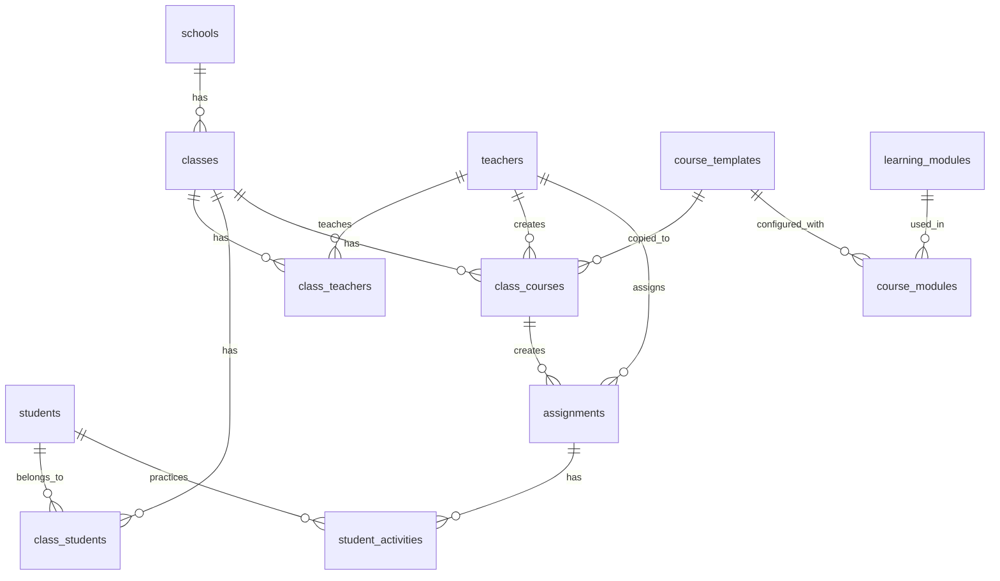

# 通用教育平台資料庫架構設計

> Universal Educational Platform Database Schema
> 基於 Duotopia 經驗的可重用架構
> Version 1.0 | 2026-02-13

---

## 🎯 設計目標

### **1. 通用性**
- 不綁定特定科目（國語、數學、英文皆可用）
- 不綁定特定學習模組（朗讀、計算、聽力皆可擴展）
- 可用於任何教育專案

### **2. 最小相依、最大彈性**
- **三層副本機制**：範本 → 班級課程 → 作業任務
- 每層都是獨立副本，互不影響
- 修改上層不影響下層（已發出的作業不變）

### **3. 真實學校情境**
- 教師可共用課程範本
- 教師可複製範本到班上自由編輯
- 作業發出後內容凍結（快照機制）
- 學生看到的永遠是作業快照，不受課程修改影響

---

## 🏗️ 架構總覽

```
【第一層：課程範本】
course_templates (課程範本)
  ├─ modules (學習模組配置)
  └─ 公開共用，可被複製

【第二層：班級課程】
class_courses (班級課程)
  ├─ 從 course_templates 複製而來
  ├─ 班級專屬副本
  └─ 教師可自由編輯

【第三層：作業任務】
assignments (作業任務)
  ├─ 從 class_courses 建立
  ├─ 內容快照（snapshot）
  └─ 發出後不隨課程變動

【第四層：學生練習】
student_activities (學生練習記錄)
  └─ 關聯到 assignment，看到的是快照內容
```

---

## 📊 核心關係圖



---

## 📝 資料表設計

### **第一層：組織架構（School Tier）**

#### `schools`（學校）
```sql
CREATE TABLE schools (
  id UUID PRIMARY KEY DEFAULT gen_random_uuid(),
  name VARCHAR(100) NOT NULL,
  created_at TIMESTAMP DEFAULT NOW()
);
```

---

#### `classes`（班級）
```sql
CREATE TABLE classes (
  id UUID PRIMARY KEY DEFAULT gen_random_uuid(),
  school_id UUID REFERENCES schools(id) ON DELETE CASCADE,
  name VARCHAR(50) NOT NULL,  -- 如「三年甲班」
  grade INT,  -- 年級
  created_at TIMESTAMP DEFAULT NOW()
);
```

---

#### `teachers`（教師）
```sql
CREATE TABLE teachers (
  id UUID PRIMARY KEY DEFAULT gen_random_uuid(),
  school_id UUID REFERENCES schools(id),
  name VARCHAR(50) NOT NULL,
  email VARCHAR(100) UNIQUE NOT NULL,
  created_at TIMESTAMP DEFAULT NOW()
);
```

---

#### `students`（學生）
```sql
CREATE TABLE students (
  id UUID PRIMARY KEY DEFAULT gen_random_uuid(),
  school_id UUID REFERENCES schools(id),
  name VARCHAR(50) NOT NULL,
  student_number VARCHAR(20),
  created_at TIMESTAMP DEFAULT NOW()
);
```

---

#### `class_teachers`（班級-教師關聯）
```sql
CREATE TABLE class_teachers (
  id UUID PRIMARY KEY DEFAULT gen_random_uuid(),
  class_id UUID REFERENCES classes(id) ON DELETE CASCADE,
  teacher_id UUID REFERENCES teachers(id) ON DELETE CASCADE,
  role VARCHAR(20) DEFAULT 'teacher',  -- 'teacher', 'co_teacher'
  created_at TIMESTAMP DEFAULT NOW(),
  UNIQUE(class_id, teacher_id)
);
```

---

#### `class_students`（班級-學生關聯）
```sql
CREATE TABLE class_students (
  id UUID PRIMARY KEY DEFAULT gen_random_uuid(),
  class_id UUID REFERENCES classes(id) ON DELETE CASCADE,
  student_id UUID REFERENCES students(id) ON DELETE CASCADE,
  seat_number INT,
  created_at TIMESTAMP DEFAULT NOW(),
  UNIQUE(class_id, student_id)
);
```

---

### **第二層：學習模組定義（Learning Modules）**

#### `learning_modules`（學習模組）

```sql
CREATE TABLE learning_modules (
  id UUID PRIMARY KEY DEFAULT gen_random_uuid(),
  name VARCHAR(50) NOT NULL,  -- 如「朗讀評估」「數學練習」「英文聽力」
  slug VARCHAR(50) UNIQUE NOT NULL,  -- 如「reading_fluency」「math_drill」
  description TEXT,
  config_schema JSONB,  -- 模組配置的 JSON Schema（定義可配置參數）
  created_at TIMESTAMP DEFAULT NOW()
);
```

**說明**：
- `slug`：模組唯一識別碼，用於程式碼邏輯
- `config_schema`：定義模組可配置參數

**範例**：
```json
{
  "name": "朗讀評估",
  "slug": "reading_fluency",
  "config_schema": {
    "required_accuracy": {"type": "number", "default": 0.9},
    "required_speed": {"type": "number", "default": 120},
    "enable_bopomofo": {"type": "boolean", "default": true}
  }
}
```

---

### **第三層：課程範本（Course Templates）**

#### `course_templates`（課程範本）

```sql
CREATE TABLE course_templates (
  id UUID PRIMARY KEY DEFAULT gen_random_uuid(),
  title VARCHAR(100) NOT NULL,
  description TEXT,
  subject VARCHAR(50),  -- 科目（如「國語」「數學」）
  grade INT,  -- 適用年級

  -- 內容
  content JSONB NOT NULL,  -- 課程內容（JSON 格式，彈性儲存）

  -- 共用設定
  is_public BOOLEAN DEFAULT FALSE,  -- 是否公開共用
  created_by UUID REFERENCES teachers(id),  -- 建立者

  -- 版本控制
  version INT DEFAULT 1,

  created_at TIMESTAMP DEFAULT NOW(),
  updated_at TIMESTAMP DEFAULT NOW()
);
```

**說明**：
- `content`：JSONB 格式，彈性儲存不同科目的內容
  - 國語：`{"text": "課文內容", "words": [...]}`
  - 數學：`{"problems": [{"question": "...", "answer": "..."}]}`
  - 英文：`{"vocabulary": [...], "sentences": [...]}`

---

#### `course_modules`（課程-模組配置）

```sql
CREATE TABLE course_modules (
  id UUID PRIMARY KEY DEFAULT gen_random_uuid(),
  course_template_id UUID REFERENCES course_templates(id) ON DELETE CASCADE,
  learning_module_id UUID REFERENCES learning_modules(id),

  -- 模組配置
  config JSONB,  -- 針對此課程的模組參數配置

  -- 排序
  sort_order INT DEFAULT 0,

  created_at TIMESTAMP DEFAULT NOW()
);
```

**說明**：
- 一個課程可以配置多個學習模組
- 例：「國小三年級國語第三課」可以配置：
  - 朗讀評估模組（`reading_fluency`）
  - 生字詞學習模組（`vocabulary_learning`）
  - 蘇格拉底對話模組（`socratic_dialogue`）

**範例**：
```json
{
  "course_template_id": "uuid-1",
  "learning_module_id": "uuid-reading-fluency",
  "config": {
    "required_accuracy": 0.9,
    "required_speed": 120,
    "enable_bopomofo": true
  }
}
```

---

### **第四層：班級課程（Class Courses）**

#### `class_courses`（班級課程）

```sql
CREATE TABLE class_courses (
  id UUID PRIMARY KEY DEFAULT gen_random_uuid(),
  class_id UUID REFERENCES classes(id) ON DELETE CASCADE,

  -- 來源（從哪個範本複製）
  source_template_id UUID REFERENCES course_templates(id) ON DELETE SET NULL,

  -- 內容（複製時的快照）
  title VARCHAR(100) NOT NULL,
  description TEXT,
  content JSONB NOT NULL,  -- 從 course_template 複製而來

  -- 模組配置（複製時的快照）
  modules JSONB,  -- 複製自 course_modules，格式：[{module_id, config}, ...]

  -- 所有權
  created_by UUID REFERENCES teachers(id),

  -- 版本追蹤
  version INT DEFAULT 1,
  source_version INT,  -- 複製時範本的版本號

  created_at TIMESTAMP DEFAULT NOW(),
  updated_at TIMESTAMP DEFAULT NOW()
);
```

**說明**：
- **複製機制**：從 `course_templates` 複製內容到 `class_courses`
- **獨立性**：`class_courses` 內容獨立，修改不影響 `course_templates`
- **追蹤來源**：`source_template_id` + `source_version` 記錄來源

---

### **第五層：作業任務（Assignments）**

#### `assignments`（作業任務）

```sql
CREATE TABLE assignments (
  id UUID PRIMARY KEY DEFAULT gen_random_uuid(),
  class_id UUID REFERENCES classes(id) ON DELETE CASCADE,

  -- 來源（從哪個班級課程建立）
  source_class_course_id UUID REFERENCES class_courses(id) ON DELETE SET NULL,

  -- 內容快照（發出作業時凍結）
  title VARCHAR(100) NOT NULL,
  instructions TEXT,
  content JSONB NOT NULL,  -- 從 class_course 複製而來（快照）
  modules JSONB,  -- 從 class_course 複製而來（快照）

  -- 作業設定
  due_date TIMESTAMP,
  required_completion BOOLEAN DEFAULT TRUE,  -- 是否必須完成

  -- 所有權
  created_by UUID REFERENCES teachers(id),

  -- 時間
  assigned_at TIMESTAMP DEFAULT NOW(),
  created_at TIMESTAMP DEFAULT NOW()
);
```

**說明**：
- **快照機制**：作業發出時，複製 `class_course` 的內容（快照）
- **內容凍結**：作業發出後，即使 `class_course` 修改，作業內容不變
- **學生看到的永遠是快照**：確保公平性與一致性

---

#### `assignment_students`（作業-學生關聯）

```sql
CREATE TABLE assignment_students (
  id UUID PRIMARY KEY DEFAULT gen_random_uuid(),
  assignment_id UUID REFERENCES assignments(id) ON DELETE CASCADE,
  student_id UUID REFERENCES students(id) ON DELETE CASCADE,

  -- 完成狀態
  status VARCHAR(20) CHECK (status IN ('not_started', 'in_progress', 'completed')) DEFAULT 'not_started',

  -- 完成時間
  started_at TIMESTAMP,
  completed_at TIMESTAMP,

  created_at TIMESTAMP DEFAULT NOW(),
  UNIQUE(assignment_id, student_id)
);
```

**說明**：
- 作業發出時，自動為班級所有學生建立 `assignment_students` 記錄
- 追蹤每位學生的完成狀態

---

### **第六層：學生練習記錄（Student Activities）**

#### `student_activities`（學生練習記錄）

```sql
CREATE TABLE student_activities (
  id UUID PRIMARY KEY DEFAULT gen_random_uuid(),
  student_id UUID REFERENCES students(id) ON DELETE CASCADE,
  assignment_id UUID REFERENCES assignments(id) ON DELETE CASCADE,

  -- 學習模組
  learning_module_slug VARCHAR(50),  -- 如「reading_fluency」

  -- 活動數據（模組特定）
  activity_data JSONB NOT NULL,  -- 彈性儲存不同模組的數據

  -- 評估結果
  score FLOAT,  -- 分數（0-100）
  passed BOOLEAN,  -- 是否通過

  created_at TIMESTAMP DEFAULT NOW()
);
```

**說明**：
- `activity_data`：彈性儲存不同學習模組的數據
  - 朗讀模組：`{"wer": 0.05, "speed": 120, "audio_url": "..."}`
  - 數學模組：`{"answer": "42", "time_spent": 30}`
  - 英文聽力：`{"selected_option": "A", "correct": true}`

---

## 🔄 資料流程（完整生命週期）

### **階段 1：教師建立課程範本**

```sql
-- 王老師建立課程範本「國小三年級國語第三課」
INSERT INTO course_templates (title, content, created_by, is_public)
VALUES (
  '國小三年級國語第三課',
  '{"text": "小明今天去學校上課...", "words": ["學", "校"]}',
  'teacher-wang-id',
  TRUE  -- 公開共用
);

-- 配置學習模組：朗讀評估
INSERT INTO course_modules (course_template_id, learning_module_id, config)
VALUES (
  'template-id',
  'reading-fluency-module-id',
  '{"required_accuracy": 0.9, "required_speed": 120}'
);
```

---

### **階段 2：李老師複製到班上**

```sql
-- 李老師看到王老師的範本很好，複製到「三年乙班」
INSERT INTO class_courses (
  class_id,
  source_template_id,
  title,
  content,
  modules,
  created_by,
  source_version
)
SELECT
  'class-3b-id',  -- 三年乙班
  ct.id,
  ct.title,
  ct.content,  -- 複製內容（快照）
  (SELECT jsonb_agg(jsonb_build_object('module_id', cm.learning_module_id, 'config', cm.config))
   FROM course_modules cm WHERE cm.course_template_id = ct.id),  -- 複製模組配置
  'teacher-lee-id',
  ct.version
FROM course_templates ct
WHERE ct.id = 'template-id';
```

**結果**：
- 李老師現在有一份「三年乙班」專屬的課程副本
- 可以自由編輯，不影響王老師的範本

---

### **階段 3：李老師微調課程內容**

```sql
-- 李老師覺得課文太長，刪掉最後一段
UPDATE class_courses
SET
  content = '{"text": "小明今天去學校...", "words": ["學", "校"]}',  -- 修改內容
  updated_at = NOW()
WHERE id = 'class-course-3b-id';
```

**結果**：
- 只有「三年乙班」的課程內容被修改
- 王老師的範本不受影響
- 其他複製此範本的班級也不受影響

---

### **階段 4：李老師發作業給班級**

```sql
-- 李老師發作業「朗讀第三課」給三年乙班
INSERT INTO assignments (
  class_id,
  source_class_course_id,
  title,
  content,
  modules,
  due_date,
  created_by
)
SELECT
  cc.class_id,
  cc.id,
  '作業：朗讀第三課',
  cc.content,  -- 複製當前內容（快照）
  cc.modules,  -- 複製當前模組配置（快照）
  '2026-02-20 23:59:59',
  'teacher-lee-id'
FROM class_courses cc
WHERE cc.id = 'class-course-3b-id';

-- 自動為班級所有學生建立作業記錄
INSERT INTO assignment_students (assignment_id, student_id, status)
SELECT
  'assignment-id',
  cs.student_id,
  'not_started'
FROM class_students cs
WHERE cs.class_id = 'class-3b-id';
```

**結果**：
- 作業內容已凍結（快照）
- 30 位學生都收到作業
- 即使李老師再修改 `class_courses`，作業內容也不變

---

### **階段 5：學生小明開始練習**

```sql
-- 小明開始朗讀練習
UPDATE assignment_students
SET
  status = 'in_progress',
  started_at = NOW()
WHERE assignment_id = 'assignment-id' AND student_id = 'student-ming-id';

-- 小明朗讀一次，記錄練習數據
INSERT INTO student_activities (
  student_id,
  assignment_id,
  learning_module_slug,
  activity_data,
  score,
  passed
)
VALUES (
  'student-ming-id',
  'assignment-id',
  'reading_fluency',
  '{"wer": 0.05, "speed": 120, "audio_url": "s3://...", "accuracy": 0.95}',
  95,
  TRUE
);
```

**結果**：
- 小明的練習數據已記錄
- 分數 95 分，通過

---

### **階段 6：小明練習到一半，李老師修改課程**

```sql
-- 李老師發現課文有錯字，修改 class_course
UPDATE class_courses
SET content = '{"text": "小明今天去學校上課（修正版）...", "words": ["學", "校"]}'
WHERE id = 'class-course-3b-id';
```

**問題**：小明練習的內容要不要更新？

**答案**：**不更新**

**原因**：
- `assignments.content` 是快照，已凍結
- `student_activities` 關聯到 `assignment_id`
- 小明看到的永遠是作業的快照內容（修改前版本）
- 確保公平性：所有學生看到的內容一致

---

### **階段 7：李老師下次發新作業**

```sql
-- 李老師再發一次作業（新的快照）
INSERT INTO assignments (...)
SELECT
  cc.class_id,
  cc.id,
  '作業：朗讀第三課（修正版）',
  cc.content,  -- 這次複製的是修正後的內容
  cc.modules,
  '2026-02-27 23:59:59',
  'teacher-lee-id'
FROM class_courses cc
WHERE cc.id = 'class-course-3b-id';
```

**結果**：
- 新作業使用修正後的內容
- 舊作業仍然使用修改前的內容
- 兩個作業並存，互不影響

---

## 🎯 關鍵查詢場景

### **場景 1：教師查看公開課程範本**

```sql
SELECT
  ct.id,
  ct.title,
  ct.subject,
  ct.grade,
  t.name AS created_by_name,
  COUNT(cc.id) AS used_count  -- 被多少班級使用
FROM course_templates ct
LEFT JOIN teachers t ON ct.created_by = t.id
LEFT JOIN class_courses cc ON cc.source_template_id = ct.id
WHERE ct.is_public = TRUE
GROUP BY ct.id, ct.title, ct.subject, ct.grade, t.name
ORDER BY used_count DESC;
```

---

### **場景 2：教師複製課程範本到班上**

```sql
-- Step 1: 複製課程內容
WITH new_class_course AS (
  INSERT INTO class_courses (
    class_id, source_template_id, title, content, modules, created_by, source_version
  )
  SELECT
    :class_id,
    ct.id,
    ct.title,
    ct.content,
    (SELECT jsonb_agg(jsonb_build_object('module_id', cm.learning_module_id, 'config', cm.config))
     FROM course_modules cm WHERE cm.course_template_id = ct.id),
    :teacher_id,
    ct.version
  FROM course_templates ct
  WHERE ct.id = :template_id
  RETURNING id
)
SELECT * FROM new_class_course;
```

---

### **場景 3：教師發作業給班級**

```sql
-- Step 1: 建立作業（快照）
WITH new_assignment AS (
  INSERT INTO assignments (
    class_id, source_class_course_id, title, content, modules, due_date, created_by
  )
  SELECT
    cc.class_id,
    cc.id,
    :assignment_title,
    cc.content,
    cc.modules,
    :due_date,
    :teacher_id
  FROM class_courses cc
  WHERE cc.id = :class_course_id
  RETURNING id
)
-- Step 2: 為所有學生建立作業記錄
INSERT INTO assignment_students (assignment_id, student_id, status)
SELECT
  na.id,
  cs.student_id,
  'not_started'
FROM new_assignment na
CROSS JOIN class_students cs
WHERE cs.class_id = :class_id;
```

---

### **場景 4：學生查看待完成作業**

```sql
SELECT
  a.id,
  a.title,
  a.due_date,
  astu.status,
  astu.started_at,
  astu.completed_at
FROM assignment_students astu
JOIN assignments a ON astu.assignment_id = a.id
WHERE astu.student_id = :student_id
  AND astu.status != 'completed'
ORDER BY a.due_date ASC;
```

---

### **場景 5：學生練習作業（查看快照內容）**

```sql
SELECT
  a.id,
  a.title,
  a.content,  -- 快照內容
  a.modules   -- 快照模組配置
FROM assignments a
JOIN assignment_students astu ON a.id = astu.assignment_id
WHERE astu.id = :assignment_student_id
  AND astu.student_id = :student_id;
```

---

### **場景 6：教師查看全班作業完成狀況**

```sql
SELECT
  s.name AS student_name,
  astu.status,
  astu.started_at,
  astu.completed_at,
  COALESCE(MAX(sa.score), 0) AS best_score
FROM assignment_students astu
JOIN students s ON astu.student_id = s.id
LEFT JOIN student_activities sa ON sa.assignment_id = astu.assignment_id AND sa.student_id = s.id
WHERE astu.assignment_id = :assignment_id
GROUP BY s.id, s.name, astu.status, astu.started_at, astu.completed_at
ORDER BY s.name;
```

---

## 📈 版本追蹤與相容性

### **問題**：如果課程範本更新，如何處理已複製的班級課程？

#### **方案 A：不自動同步（推薦）**
- 班級課程是獨立副本
- 範本更新不影響已複製的班級課程
- 教師可手動「重新複製」獲得新版本

**優點**：
- 簡單、清晰
- 不會意外破壞教師的修改

**缺點**：
- 教師需要手動更新

---

#### **方案 B：提供「同步」功能（進階）**
- 追蹤範本版本號（`source_version`）
- 當範本更新時，通知教師「有新版本可用」
- 教師可選擇「同步」（會覆蓋修改）或「忽略」

**實作**：
```sql
-- 查詢哪些班級課程有新版本可用
SELECT
  cc.id,
  cc.title,
  cc.source_version AS current_version,
  ct.version AS latest_version
FROM class_courses cc
JOIN course_templates ct ON cc.source_template_id = ct.id
WHERE ct.version > cc.source_version;
```

---

## 🔐 權限控制

### **課程範本權限**
```sql
-- 只能查看公開範本 + 自己建立的範本
SELECT * FROM course_templates
WHERE is_public = TRUE
   OR created_by = :current_teacher_id;
```

### **班級課程權限**
```sql
-- 只能查看自己教的班級的課程
SELECT cc.*
FROM class_courses cc
JOIN class_teachers ct ON cc.class_id = ct.class_id
WHERE ct.teacher_id = :current_teacher_id;
```

### **作業權限**
```sql
-- 學生只能查看自己的作業
SELECT a.*
FROM assignments a
JOIN assignment_students astu ON a.id = astu.assignment_id
WHERE astu.student_id = :current_student_id;
```

---

## 🚀 擴展性：新增學習模組

### **範例：新增「英文聽力」模組**

**Step 1：註冊模組**
```sql
INSERT INTO learning_modules (name, slug, config_schema)
VALUES (
  '英文聽力',
  'english_listening',
  '{
    "playback_speed": {"type": "number", "default": 1.0},
    "allow_replay": {"type": "boolean", "default": true}
  }'
);
```

**Step 2：在課程範本中配置**
```sql
INSERT INTO course_modules (course_template_id, learning_module_id, config)
VALUES (
  'english-course-id',
  'english-listening-module-id',
  '{"playback_speed": 1.0, "allow_replay": true}'
);
```

**Step 3：學生練習時記錄數據**
```sql
INSERT INTO student_activities (
  student_id,
  assignment_id,
  learning_module_slug,
  activity_data,
  score
)
VALUES (
  'student-id',
  'assignment-id',
  'english_listening',
  '{"audio_url": "...", "selected_answer": "A", "correct_answer": "B", "time_spent": 30}',
  0
);
```

---

## ✅ 設計檢查清單

- [x] **三層副本機制**：範本 → 班級課程 → 作業任務
- [x] **內容凍結**：作業發出後內容不隨課程變動
- [x] **最小相依**：每層都是獨立副本
- [x] **最大彈性**：教師可自由編輯班級課程
- [x] **學習模組可擴展**：新增模組不影響現有架構
- [x] **JSONB 彈性儲存**：不同科目、不同模組都能用
- [x] **版本追蹤**：記錄複製來源與版本號
- [x] **權限控制**：教師、學生各自權限清楚

---

## 📊 資料量估算

**假設**：
- 100 所學校
- 每校 20 個班級
- 每班 25 位學生
- 總學生數：50,000 位

**儲存估算**：

| 表格 | 估算筆數 | 平均大小 | 總容量 |
|------|---------|---------|--------|
| `schools` | 100 | 1 KB | 100 KB |
| `classes` | 2,000 | 1 KB | 2 MB |
| `teachers` | 5,000 | 1 KB | 5 MB |
| `students` | 50,000 | 1 KB | 50 MB |
| `course_templates` | 1,000 | 10 KB | 10 MB |
| `class_courses` | 10,000 | 10 KB | 100 MB |
| `assignments` | 100,000 | 10 KB | 1 GB |
| `student_activities` | 5,000,000 | 2 KB | 10 GB |

**總計**：約 **11.2 GB / 年**（不含媒體檔案）

---

## 💡 關鍵設計決策

### **決策 1：為什麼要三層副本？**

**問題**：為什麼不直接用「課程範本 → 作業」兩層？

**答案**：
- **班級客製化需求**：不同班級進度不同，需要獨立編輯空間
- **教師自主性**：教師需要「自己班級的課程」，可自由調整
- **避免全局影響**：範本修改不應影響所有班級

---

### **決策 2：為什麼作業要快照？**

**問題**：為什麼不讓作業「參照」班級課程（指標方式）？

**答案**：
- **公平性**：學生看到的內容必須一致，不能因課程修改而變動
- **歷史記錄**：作業是特定時間點的快照，便於追蹤
- **避免意外**：教師修改課程不應影響已發出的作業

---

### **決策 3：為什麼用 JSONB 儲存內容？**

**問題**：為什麼不用關聯表儲存課程內容？

**答案**：
- **彈性**：不同科目內容結構差異大（國語有課文，數學有題目）
- **快照友善**：JSONB 可直接複製，不需要複製多個關聯表
- **擴展性**：新增科目不需要修改資料庫 Schema

---

## 🎓 總結

這個架構的核心思想：

1. **三層副本**：範本 → 班級課程 → 作業任務
2. **內容凍結**：每層複製時都是快照，互不影響
3. **學習模組可插拔**：新增模組不影響架構
4. **最小相依、最大彈性**：教師可自由編輯，不影響他人

**適用範圍**：
- ✅ 朗朗上口（國語文朗讀）
- ✅ Duotopia（數學練習）
- ✅ 英文聽力平台
- ✅ 任何教育專案

---

**文件維護**：
- **建立日期**：2026-02-13
- **維護者**：Young Tsai
- **最後更新**：2026-02-13

**參考資料**：
- Duotopia 校班師生課架構
- Google Classroom 作業機制
- Notion 資料庫架構
