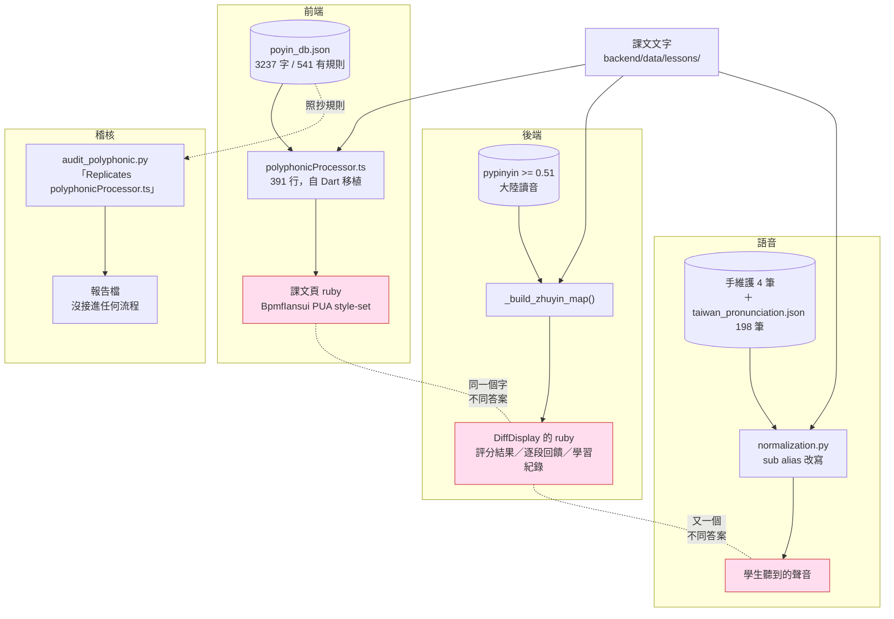
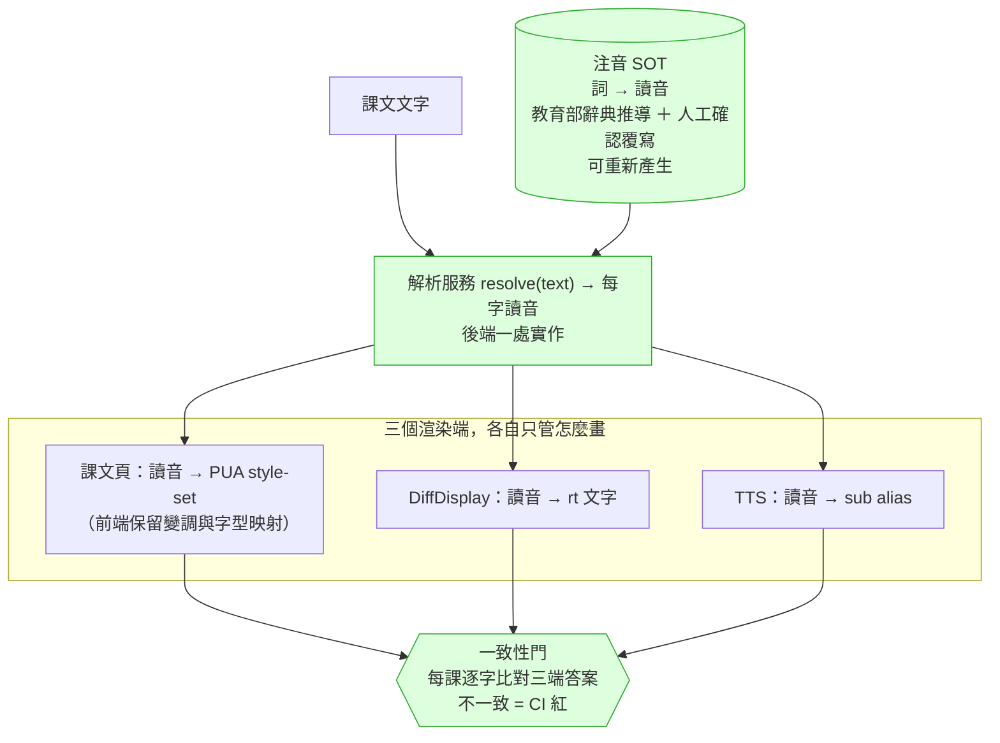

# 注音（破音字）單一真相來源 — PRD

> 起因：2026-09-12 使用者回報兩個注音標錯。查下去發現的不是兩個錯字，是
> **同一個問題由四套系統各自回答，而且沒有任何一道門比較過它們的答案**。
>
> 相關：#3173（那兩個字的修復）· #1353（2026-05-01 的破音字稽核，已 CLOSED 但 Phase 2–4 未做）

---

## 1. 現況（Check）

### 1.1 使用者看到的

課程 `20013`《正太與小豬：武僧的養成之路》，重點朗讀頁：

| 詞 | 畫面標的 | 正確 |
|---|---|---|
| 功夫**了**得 | ㄌㄜ˙ | ㄌㄧㄠˇ |
| 有多**難** | ㄋㄢˋ | ㄋㄢˊ |

⭐ **但同一課的朗讀比對畫面，同一個「難」是對的。** 使用者自己在那張截圖上打了勾。
兩個畫面、同一個字、不同答案 —— 因為它們背後是兩套不同的引擎。

### 1.2 實際上有幾套（全部實測確認）

| # | 系統 | 位置 | 資料 | 服務誰 |
|---|---|---|---|---|
| 1 | **前端顯示引擎** | `frontend/src/components/zhuyin/polyphonicProcessor.ts`（391 行，自 Dart 移植） | `frontend/public/data/poyin_db.json`（3237 字，541 個有規則） | 課文頁的 ruby 注音 |
| 2 | **後端比對注音** | `backend/app/routes/learning/learning_reading.py:_build_zhuyin_map` | `pypinyin>=0.51` | `DiffToken.zhuyin` → `DiffDisplay` 的 `<ruby>`：朗讀評分結果、逐段回饋、學習紀錄 |
| 3 | **TTS 發音修正** | `backend/app/services/tts/normalization.py` | 手維護 4 筆 ＋ `backend/data/tts/taiwan_pronunciation.json`（198 筆，教育部辭典推導） | 學生**聽到**的聲音 |
| 4 | **稽核用的第三份實作** | `backend/scripts/audit_polyphonic.py` | 讀 #1 的 `poyin_db.json` | 只產報告，**沒有接進任何流程** |

`audit_polyphonic.py` 的註解自己寫著 **「Replicates core logic of polyphonicProcessor.ts match()」**
—— 有人早就需要後端理解前端的規則，而解法是**再抄一份邏輯**。

### 1.3 各自的缺陷（實測，不是推論）

**① 前端資料表**（直接抓 prod 線上那份，`HTTP 200`）：

```json
"了": {"s": 2, "v": ["", "*不起/*結/*解/受不*/*不得/知*/吃不*"]}
"難": {"s": 3, "v": ["困*/", "災*/問*/發*/海*/多*/大*/…", "*然"]}
```

- `了` 的 ㄌㄧㄠˇ 組**沒有 `*得`** → 「了得」落到預設 ㄌㄜ˙
- `難` 的 ㄋㄢˋ 組**含 `多*`** → 「有多難」被當成「多難興邦」

**② 後端 pypinyin**（11 個案例實跑，7 對 4 錯）：

| 句子 | 應為 | pypinyin |
|---|---|---|
| 功夫**了**得 | ㄌㄧㄠˇ | ㄌㄧㄠˇ ✓ |
| 有多**難** | ㄋㄢˊ | ㄋㄢˊ ✓ |
| **災難** / **患難**與共 / **難民** / **多難**興邦 | ㄋㄢˋ | ㄋㄢˊ ⛔ |

**pypinyin 根本不產生 `難` 的 ㄋㄢˋ 讀音。** 它給的是大陸讀音，這也正是 #3 那張
教育部推導表存在的理由（它的 docstring 自己說：「compare against pypinyin's mainland reading」）。

**③ 兩套的錯誤方向相反** —— 前端把「有多難」讀成 ㄋㄢˋ，後端把「災難」讀成 ㄋㄢˊ。
換掉任何一邊都不是升級，是換一批 bug。

### 1.4 影響面

| 形狀 | 出現 | 說明 |
|---|---|---|
| `了得`（前端會錯） | 24 處 | 掃 2550 個課程檔 |
| `多難` 非「多難興邦」（前端會錯） | 21 處 | |
| `多難興邦`（`多*` 規則存在的唯一理由） | **0 處** | 那條規則從沒派上用場 |
| `災難`/`難民`/`苦難`/`劫難`/`危難`/`逃難`/`受難`/`空難`（後端會錯） | 251 處 / 30 課 | |

⚠️ **這些數字是檔案層級的，被 `_extracted` 等中繼檔灌水了**；而且我**沒有**過濾
「這個詞有沒有落在學生真的會朗讀的重點段裡」。真正到學生眼前的數量比這少，
要多少才算真的，得再量一次。**不要拿這裡的 251 去做決策。**

### 1.5 2026-05-01 已經有人看過這件事

`docs/audit/polyphonic-audit-2026-05-01.md`（issue #1353，教授提出「喝采」讀錯）：

- 掃出 **5155 處破音字、4298 處需人工確認**
- 建議 Phase 2–4：Gemini 批次標注 → YAML `phoneme_overrides` 欄位 → 老師確認 UI
- **#1353 已 CLOSED，Phase 2/3/4 一個都沒做**
- 那份報告最後一條待辦到今天仍然成立：「確認 `喝` 的**注音顯示**（不只 TTS）是不是也錯」

TTS 那側的 docstring 也已經下過同樣的判斷：

> 「手維護的清單是四筆，每次有人剛好聽到錯才加一筆。**那不會收斂**：
> 2026-05-01 的稽核找出 4298 項要複查、只有 22 項曾被修掉，而 2026-08-09 回報的四個案例
> 一個都不在表裡。」

**所以「逐筆修表」這條路，這個 repo 已經證明過它不收斂了。**

---

## 2. 根因（Root Cause）

**不是「表裡少一筆」。**

根因是：**「這個字在這個詞裡怎麼念」這個問題，由四個系統各自回答，而它們從來不比較答案。**

三個結構性後果：

1. **沒有人是權威。** 四套都是「某個當下為了某個局部需求」長出來的：
   前端為了 ruby 字型（PUA style-set）、後端為了朗讀比對、TTS 為了 Azure 發音、
   稽核為了寫報告。沒有一套被指定為真相。
2. **漂移不可見。** 沒有任何一道門問「同一段文字，四套的答案一致嗎」。
   所以兩個畫面標不同注音這件事，是**使用者**發現的，不是系統發現的。
3. **修一處不會傳播。** #1353 修了 TTS 的「喝采」，而**注音顯示至今仍是錯的** ——
   那份報告自己留著這條待辦，四個半月沒動。

---

## 3. BEFORE 結構



**四條路從同一份課文出發，走到三個學生感知得到的出口，沒有任何一處交會。**

---

## 4. AFTER 應該怎麼改

### 4.1 設計原則

> **Young 2026-09-12 定調：「可以有多方的來源，但是系統上應該就是一套 SOT。」**
>
> 這句話把「來源」跟「真相」分開了，而那正是現在四份實作糾纏的地方。
>
> - **來源（多方，OK）**：教育部《重編國語辭典修訂本》、pypinyin、前端既有的
>   `poyin_db.json` 規則、老師／教授的人工確認、未來的 AI 標注。
>   它們是**輸入**，各有涵蓋範圍與可信度，可以並存、可以互相補。
> - **SOT（一套，強制）**：系統在執行期只能問**一個**地方「這個字在這個詞裡怎麼念」。
>   多方來源必須先**匯流成那一份**，帶著各自的出處與優先序，而不是讓消費端各自挑一個來源用。
>
> ⛔ 現在的病正是「四個消費端各自綁死一個來源」。改法不是砍掉三個來源，
> 是**讓來源可以多，但收斂點只有一個**。

**一個字在一個詞裡的讀音，只能有一個地方說了算；字型怎麼畫是另一回事。**

要把兩件事分開，這是前幾次嘗試沒分開的地方：

| 關注點 | 誰負責 | 為什麼不能合併 |
|---|---|---|
| **讀音是什麼**（ㄋㄢˊ 還是 ㄋㄢˋ） | **SOT，一處** | 語言事實，跟畫面無關 |
| **怎麼畫出來** | 各消費端 | 前端要 BpmfIansui 的 PUA style-set，`DiffDisplay` 要純文字 `<rt>`，TTS 要 `<sub alias>` — 三種載體，不可能共用 |

⛔ **前端那套不能整個丟掉。** 它還負責 `一`/`不` 的變調與 PUA 映射，那是渲染層的事。
要換掉的是它的**讀音判斷**，不是它的渲染。

### 4.1b ⭐ 2026-09-12 實測反轉了一個前提

原本這份 PRD 隱含「兩套一樣爛，各修各的」。**實測之後不是這樣：**

- 前端 vs 後端逐字比對 **151 課 / 58678 字 → 2038 處不一致（3.47%）**
- 最大宗的不是誰有 bug，是**後端根本做不到的事**：
  `不`／`一` 的變調 617 處、`個` 的輕聲 204 處、`和` 的台灣讀音 168 處 —— **前端對，pypinyin 結構上產不出來**
- 九個對照案例實跑：前端 7 對 2 錯（錯的正是使用者報的那兩個）；pypinyin 在同一批 `難` 的詞上 4 個全錯

→ **後端是兩者中較弱的引擎。** 所以 SOT **不能**建在 pypinyin 上，
也**不是**「把前端換成後端」。方向是：**以前端既有的規則體系＋台灣讀音辭典為基礎收斂成 SOT，
把後端那條改成消費者**。

⚠️ 未逐類人工核對「誰對」，變調與台灣讀音那幾類有把握，「看語境」那幾類沒有。
詳見事實清單 F-bis。

### 4.2 SOT 選誰

**不要新造。** `backend/data/tts/taiwan_pronunciation.json` 已經是正確形狀的雛型：

- 依據**教育部《重編國語辭典修訂本》**（台灣讀音，不是大陸讀音）
- **推導產生**而非手維護 —— 它的 docstring 明確寫「Adding coverage means regenerating the file, not appending another tuple here」
- 已有 198 筆、帶 `_source` / `_method` / `_verified` / `_known_gaps` 欄位

**缺口**：它只收「台灣讀音 ≠ 大陸讀音」的詞，所以 `了得`（兩岸同讀 ㄌㄧㄠˇ）、
`災難`（pypinyin 的多音字選擇問題）**都不在裡面**。SOT 要擴成
「**詞 → 讀音**」的完整詞典，而不只是「兩岸差異表」。

### 4.3 目標結構



### 4.4 分階段（不要 big-bang）

| 階段 | 做什麼 | 完成判準 |
|---|---|---|
| **0. 止血** | 修 #3173 那兩筆（前端資料表）＋ 把 `難` 的 ㄋㄢˋ 讀音補進後端路徑 | 使用者回報的兩個字在兩個畫面都對 |
| **1. 讓漂移看得見** | 建**一致性門**：對每課的重點段，比對三端的逐字讀音，不一致就列出來。**先只報告不擋** | 拿到一份「目前有幾處不一致」的真實數字 —— 這是所有後續決策的地基，現在沒有人知道這個數字 |
| **2. 立 SOT** | 把 `taiwan_pronunciation.json` 擴成完整詞→讀音詞典；保留「可重新產生」的性質；人工確認的覆寫另存一層，不混進產生檔 | SOT 能覆蓋階段 1 找到的全部不一致處 |
| **3. 接消費端** | 後端出 `resolve()`；`DiffDisplay` 與 TTS 先接；前端最後接（它要改的最多，因為要保留 PUA 映射） | 每接一端，階段 1 的不一致數字下降且不回升 |
| **4. 門轉成擋** | 一致性門從「報告」改成「不一致就紅」 | 新課文上架時不可能再帶進三端打架的注音 |
| **5. 清理** | 刪掉 `audit_polyphonic.py` 那份抄來的邏輯（屆時 SOT 就是唯一答案，不需要複製比對） | 全庫只剩一處在回答「怎麼念」 |

⭐ **階段 1 先做，而且它自己就有價值。** 現在最大的問題不是「沒有 SOT」，是
**沒有人知道到底有多少處不一致** —— #1353 那份報告用的是「照抄前端規則的稽核器」量的，
量的是「前端自己一致嗎」，不是「三端一致嗎」。

### 4.5 明確不做

- ⛔ **不整個換成 pypinyin** —— 實測它 4/11 錯，且系統性缺 `難` 的 ㄋㄢˋ 讀音
- ⛔ **不繼續逐筆手加修正表** —— TTS 那側的 docstring 已經記錄過這條路不收斂
  （4298 待查 / 22 曾修 / 新回報的四個一個都不在表裡）
- ⛔ **不在階段 0 就重構** —— 使用者在等那兩個字
- ⛔ **不動渲染層**（PUA、字型、變調）—— 那不是這個 PRD 的題目

---

## 5. 我還沒驗的（不要當成已知）

誠實列著，這些都會影響上面的判斷：

1. **我沒有真的跑過 `PolyphonicProcessor`。** 前端那兩個根因是**讀 `poyin_db.json` 推論**的，
   而 gate 0 明寫「讀 code ＋ 查資料推論不算復現」。要用真資料跑一次 `process('功夫了得')`
   與 `process('有多難')`，確認 `styleSet` 真的是我說的那個。
2. **1.4 的影響數字是檔案層級的**，被中繼檔灌水，也沒過濾「有沒有落在學生會朗讀的段落裡」。
3. **三端不一致的真實處數，完全沒量過** —— 那正是階段 1 要做的事。
4. **`喝采` 的注音顯示現在是對是錯**，#1353 留的那條待辦仍未確認。
5. **SOT 擴充的成本沒估過** —— 教育部辭典的授權與取得方式、能覆蓋多少詞，都還沒查。
