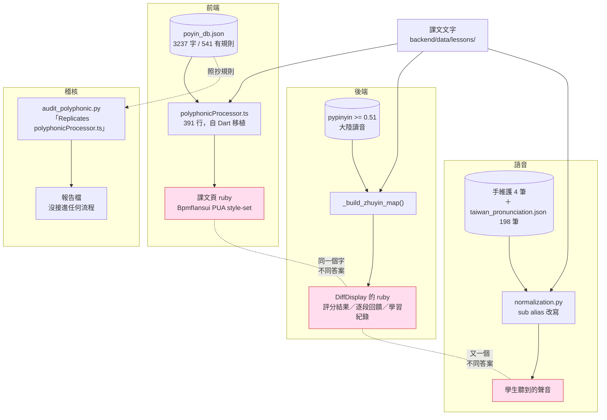
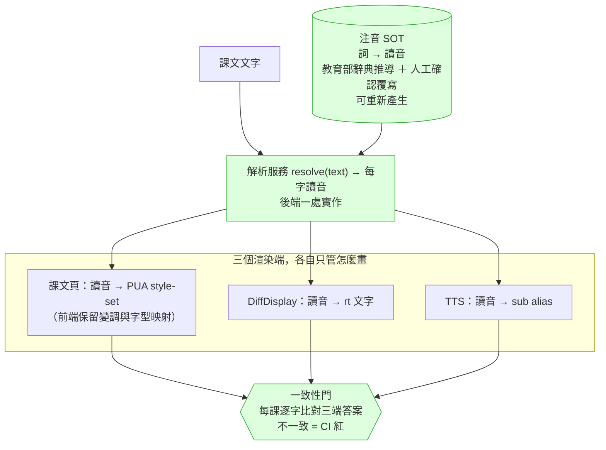

# 注音（破音字）單一真相來源 — PRD

> 起因：2026-09-12 使用者回報兩個注音標錯。查下去發現的不是兩個錯字，是
> **同一個問題由四套系統各自回答，而且沒有任何一道門比較過它們的答案**。
>
> 相關：#3173（那兩個字的修復）· #1353（2026-05-01 的破音字稽核，已 CLOSED 但 Phase 2–4 未做）

---

## 1. 現況（Check）

### 1.1 使用者看到的

課程 `20013`《正太與小豬：武僧的養成之路》，重點朗讀頁：

| 詞 | 畫面標的 | 正確 |
|---|---|---|
| 功夫**了**得 | ㄌㄜ˙ | ㄌㄧㄠˇ |
| 有多**難** | ㄋㄢˋ | ㄋㄢˊ |

⭐ **但同一課的朗讀比對畫面，同一個「難」是對的。** 使用者自己在那張截圖上打了勾。
兩個畫面、同一個字、不同答案 —— 因為它們背後是兩套不同的引擎。

### 1.2 實際上有幾套（全部實測確認）

| # | 系統 | 位置 | 資料 | 服務誰 |
|---|---|---|---|---|
| 1 | **前端顯示引擎** | `frontend/src/components/zhuyin/polyphonicProcessor.ts`（391 行，自 Dart 移植） | `frontend/public/data/poyin_db.json`（3237 字，541 個有規則） | 課文頁的 ruby 注音 |
| 2 | **後端比對注音** | `backend/app/routes/learning/learning_reading.py:_build_zhuyin_map` | `pypinyin>=0.51` | `DiffToken.zhuyin` → `DiffDisplay` 的 `<ruby>`：朗讀評分結果、逐段回饋、學習紀錄 |
| 3 | **TTS 發音修正** | `backend/app/services/tts/normalization.py` | 手維護 4 筆 ＋ `backend/data/tts/taiwan_pronunciation.json`（198 筆，教育部辭典推導） | 學生**聽到**的聲音 |
| 4 | **稽核用的第三份實作** | `backend/scripts/audit_polyphonic.py` | 讀 #1 的 `poyin_db.json` | 只產報告，**沒有接進任何流程** |

`audit_polyphonic.py` 的註解自己寫著 **「Replicates core logic of polyphonicProcessor.ts match()」**
—— 有人早就需要後端理解前端的規則，而解法是**再抄一份邏輯**。

### 1.3 各自的缺陷（實測，不是推論）

**① 前端資料表**（直接抓 prod 線上那份，`HTTP 200`）：

```json
"了": {"s": 2, "v": ["", "*不起/*結/*解/受不*/*不得/知*/吃不*"]}
"難": {"s": 3, "v": ["困*/", "災*/問*/發*/海*/多*/大*/…", "*然"]}
```

- `了` 的 ㄌㄧㄠˇ 組**沒有 `*得`** → 「了得」落到預設 ㄌㄜ˙
- `難` 的 ㄋㄢˋ 組**含 `多*`** → 「有多難」被當成「多難興邦」

**② 後端 pypinyin**（11 個案例實跑，7 對 4 錯）：

| 句子 | 應為 | pypinyin |
|---|---|---|
| 功夫**了**得 | ㄌㄧㄠˇ | ㄌㄧㄠˇ ✓ |
| 有多**難** | ㄋㄢˊ | ㄋㄢˊ ✓ |
| **災難** / **患難**與共 / **難民** / **多難**興邦 | ㄋㄢˋ | ㄋㄢˊ ⛔ |

**pypinyin 根本不產生 `難` 的 ㄋㄢˋ 讀音。** 它給的是大陸讀音，這也正是 #3 那張
教育部推導表存在的理由（它的 docstring 自己說：「compare against pypinyin's mainland reading」）。

**③ 兩套的錯誤方向相反** —— 前端把「有多難」讀成 ㄋㄢˋ，後端把「災難」讀成 ㄋㄢˊ。
換掉任何一邊都不是升級，是換一批 bug。

### 1.4 影響面

| 形狀 | 出現 | 說明 |
|---|---|---|
| `了得`（前端會錯） | 24 處 | 掃 2550 個課程檔 |
| `多難` 非「多難興邦」（前端會錯） | 21 處 | |
| `多難興邦`（`多*` 規則存在的唯一理由） | **0 處** | 那條規則從沒派上用場 |
| `災難`/`難民`/`苦難`/`劫難`/`危難`/`逃難`/`受難`/`空難`（後端會錯） | 251 處 / 30 課 | |

⚠️ **這些數字是檔案層級的，被 `_extracted` 等中繼檔灌水了**；而且我**沒有**過濾
「這個詞有沒有落在學生真的會朗讀的重點段裡」。真正到學生眼前的數量比這少，
要多少才算真的，得再量一次。**不要拿這裡的 251 去做決策。**

### 1.5 2026-05-01 已經有人看過這件事

`docs/audit/polyphonic-audit-2026-05-01.md`（issue #1353，教授提出「喝采」讀錯）：

- 掃出 **5155 處破音字、4298 處需人工確認**
- 建議 Phase 2–4：Gemini 批次標注 → YAML `phoneme_overrides` 欄位 → 老師確認 UI
- **#1353 已 CLOSED，Phase 2/3/4 一個都沒做**
- 那份報告最後一條待辦到今天仍然成立：「確認 `喝` 的**注音顯示**（不只 TTS）是不是也錯」

TTS 那側的 docstring 也已經下過同樣的判斷：

> 「手維護的清單是四筆，每次有人剛好聽到錯才加一筆。**那不會收斂**：
> 2026-05-01 的稽核找出 4298 項要複查、只有 22 項曾被修掉，而 2026-08-09 回報的四個案例
> 一個都不在表裡。」

**所以「逐筆修表」這條路，這個 repo 已經證明過它不收斂了。**

---

## 2. 根因（Root Cause）

**不是「表裡少一筆」。**

根因是：**「這個字在這個詞裡怎麼念」這個問題，由四個系統各自回答，而它們從來不比較答案。**

三個結構性後果：

1. **沒有人是權威。** 四套都是「某個當下為了某個局部需求」長出來的：
   前端為了 ruby 字型（PUA style-set）、後端為了朗讀比對、TTS 為了 Azure 發音、
   稽核為了寫報告。沒有一套被指定為真相。
2. **漂移不可見。** 沒有任何一道門問「同一段文字，四套的答案一致嗎」。
   所以兩個畫面標不同注音這件事，是**使用者**發現的，不是系統發現的。
3. **⭐ 真正的病不是「做不完」，是「結構那段做不完」。**
   我原本在這裡寫「#1353 修了 TTS 的喝采，而注音顯示至今仍是錯的、四個半月沒動」——
   **那句是錯的**。`2fd203bb2`（稽核**當晚** 21:30）就把注音顯示修好了，在 main 與 staging，
   而且 `*采` 在那之前就在表裡（見事實清單 G5）。
   checkbox 沒打勾是真的，**但事情做完了** —— 那個機制**兩個方向都失效**：沒追到完成、也沒人回去讀。
   → 這個 repo **每次都把止血做完，每次都沒把結構做完**。
   所以驗收要防的是「**結構工作沒有可見的未完成訊號**」，不是防偷懶，
   而且**答案不是再加幾個 checkbox**。

---

## 3. BEFORE 結構



**四條路從同一份課文出發，走到三個學生感知得到的出口，沒有任何一處交會。**

---

## 3.5 ⭐ 五條路的全景（純文字版，2026-09-12）

```
                           課文文字（backend/data/lessons/）
                                      │
        ┌──────────────┬──────────────┼──────────────┬──────────────┐
        │              │              │              │              │
     ① 課文頁       ② 朗讀回饋      ③ 語音          ④ 字典頁      ⑤ 稽核腳本

  前端               後端            後端            後端          後端
  polyphonic         _build_        tts/            dictionary_   audit_
  Processor.ts       zhuyin_map     normalization   service.py    polyphonic.py
        │              │              │              │              │
     讀 poyin_db    讀 pypinyin    讀 手維護4筆     打萌典 API    讀 poyin_db
     .json          （大陸讀音）    ＋台灣讀音198    取第一個      ＋「抄一份
     3237 字                        （教育部推導）   異體字讀音    前端的邏輯」
        │              │              │              │              │
     算出 styleSet   算出注音字串    改寫成          存 DB 快取    產報告檔
     ss01/0000       ㄋㄢˊ          <sub alias>         │              │
        │              │              │              │              │
     ↓ 交給字型      ↓ <rt>         ↓ 送 Azure      ↓ 顯示        ↓ 沒人看
  ┌──────────────┐                                                （沒接線）
  │ BpmfZihiSerif │
  │ .ttf          │ ← ⭐ 讀音的客觀真值藏在這裡
  │ z_nan4 元件   │    （13087 字 / 2037 多音字）
  └──────────────┘    只有 ① 用到它，而且是間接用
        │
   畫出 ruby 注音
        │
   ┌────┴────┬──────────────┬──────────────┬──────────────┐
   ▼         ▼              ▼              ▼              ▼
 課文頁   評分結果        學生聽到       字典頁         （無）
 重點朗讀 逐段回饋        的聲音
          學習紀錄
   ↑         ↑              ↑              ↑
  學生      學生           學生           學生
```

**四條路各自有錯，方向還相反：**

```
              了得        有多難      災難/難民    銀行/著作
  ① 前端      ⛔ ㄌㄜ˙     ⛔ ㄋㄢˋ     ✓ 對        ⛔ 反了（833 處中 813）
  ② pypinyin  ✓ 對        ✓ 對        ⛔ 全錯      ─
  ③ TTS       表裡沒有     表裡沒有     表裡沒有     表裡沒有
  ④ 字典頁    取第一個，不看語境
```

**①②③④ 之間沒有任何一條線互相比對。**
所以「同一課同一個字、兩個畫面不同注音」是**使用者**發現的，不是系統發現的。

### 前後段的切法（這是重點）

```
   前段：這個字在這個詞裡怎麼念        後段：怎麼畫／怎麼唸出來
   ──────────────────────────        ──────────────────────────
   ⭐ 應該只有一個地方說了算           本來就該三份，不可能共用
                                      ├─ 課文頁 → PUA 選擇器（綁字型）
   現在：四個地方各自回答              ├─ 回饋頁 → <rt> 純文字
                                      └─ 語音   → <sub alias>（換語音就作廢）
```

---

## 3.6 ⭐⭐ 這個複雜度有必要嗎？沒有。

Young 2026-09-12 問：「我們有必要用這麼複雜的架構嗎？裡面到底真的有用的東西是哪些？」

**答案：真正必要的只有兩份資料、一個解析、三個渲染。其餘是長出來的，不是設計出來的。**

### 真的有用的（留）

| 東西 | 為什麼非它不可 |
|---|---|
| **字型 `BpmfZihiSerif-Regular.ttf`** | 它**同時是**讀音真值（13087 字，`z_<拼音><聲調>` 元件名）**和**渲染器。拿掉它注音就畫不出來。而且它已經在出貨 |
| **`poyin_db.json` 的 `v[]` 樣式** | 「這個詞裡選哪一個讀音」的知識本體。3237 字、541 個有規則，與字型變體數 **541/541 對齊** |
| **一個 `resolve()`** | 前段唯一的答案來源 |
| **三個渲染端** | PUA 選擇器／`<rt>` 文字／`<sub alias>`，三種載體**本來就不可能共用**，這不是重複 |
| **一致性門** | 唯一能讓「四邊不一致」被系統而不是使用者發現的東西 |

### 沒有用的（刪）

| 東西 | 為什麼可以刪 |
|---|---|
| **`pypinyin` 在讀音路徑上** | 字型覆蓋語料 **99.998%**，沒有任何位置需要它當 fallback。而它**做不到變調、給的是大陸讀音、系統性不產生 `難` 的 ㄋㄢˋ**。它比留下來的差，不是補充 → **只留在產生器當「兩岸分歧偵測器」** |
| **`audit_polyphonic.py`** | 自己註解寫「Replicates core logic of polyphonicProcessor.ts」—— 量的是抄本不是本尊，而且**沒接進任何流程** → 直接刪 |
| **`poyin_db` 的 `d` 欄位** | 全庫只有 2 筆（著、行），**兩筆都是錯的**，而且它的前提（字型預設是 v[1]）被字型本身推翻 → 刪掉欄位，順便刪掉那個概念 |
| **`taiwan_pronunciation.json` 當成執行期來源** | 它是「台灣讀音 ≠ 大陸讀音」的差異表，存在的理由是 pypinyin 給錯。**pypinyin 一走，它降級成產生器的輸入**，不再是第四份真相 |

### 所以目標架構其實很小

```
   ┌─ 字型（讀音真值）──┐
   │                     ├──→  resolve(text) ──┬──→ PUA 選擇器 → 課文頁
   └─ poyin_db（選哪個）┘         一處          ├──→ <rt> 文字   → 回饋頁
                                                └──→ <sub alias> → 語音
                                        │
                                   一致性門（四邊比對，report-only → 擋）
```

**兩份資料、一個解析、三個渲染、一道門。** 沒有詞典要建、沒有標注要跑、沒有後台要做。

### ⚠️ 我上一輪講錯的事，在這裡更正

我把「`CC BY-ND` 擋住教育部辭典」講成「授權擋住 SOT」。**那是錯的。**

ND 禁的是**改作他們的資料**，不禁我們自己整理一份自己的表。
而且上面那兩份資料 —— **字型與 `poyin_db` —— 都已經在我們 repo 裡出貨**，
從這兩份機械推導已經得到 **3223 列詞→讀音、只有 3 列自相矛盾**（一日／教學／褶褶），
全程零萌典。

→ **SOT 不是「從零建一本詞典」，主要是「刪掉三份多餘的」再把剩下的接起來。**
→ 萌典只在「要補涵蓋率」時當**選配輸入**，不 vendor 進 repo 就沒有 ND 問題。

⚠️ 未查：`poyin_db.json` 自己的來歷沒查過。它已經在公開 repo 出貨，
是既有狀態不是這次新增的曝險，但該查清楚。

---

## 3.7 ⭐ 兩份來源的真實來歷（git 查證，2026-09-12）

Young 問了兩個問題，答案都改變了對這件事的理解。

### pypinyin 不是有人挑的，是它剛好躺在那裡

```
c17f4177c  2026-02-21  Youngger9765
  「feat: add full-stack codebase + GCP Cloud Run deployment + CI/CD」
  ├─ requirements.txt 第 9 行            pypinyin>=0.51
  └─ frontend/src/components/zhuyin/     polyphonicProcessor.ts   645 行
                                          toneData.ts            3695 行
                                          bopomoConstants.ts / pinyin.ts

2026-02-21 → 2026-06-15   pypinyin 四個月零使用，沒有任何 commit 碰它
2026-06-15  bf6f54e19     「add bopomofo ruby annotations to per-character diff tokens」(#2227)
                          要幫 diff 加注音 → 伸手拿了已經裝著的那個
今天                       全庫只有一個檔 import 它：learning_reading.py:22
```

**同一顆骨架 commit 同時帶進了前端那套完整引擎與 pypinyin。**
前端那套從第一天就是真正的系統；pypinyin 是相依套件，四個月沒人用。
第二套引擎的出現不是一個技術決定，是**手邊剛好有**。

→ 這也解釋了為什麼沒有人比對過兩者：**沒有人意識到自己引進了第二套。**

### `taiwan_pronunciation.json` 確實是為了避開大陸音 —— 而且是 Hans 回報後才補的

```
2026-08-10  Young 一天三顆
  69312eff6  fix(#2612): derive Taiwan pronunciation corrections from the MOE dictionary
  c53c68d38  fix(#2649): cover the tone differences — the class Hans actually reported
  ba414f59e  docs(#2649): record what was actually tested for the polyphones

_method:「jieba 斷詞 → 教育部注音 vs pypinyin(大陸) 比對聲韻 → 自動生成同音單讀字 alias」
```

它**只服務 TTS**（Azure 的 `<sub alias>`），不碰畫面上的注音。

### ⭐⭐ 檔案裡那句「修不掉」，其實是兩件事被混在一起

```
_not_covered:「多音字（著、和…）無法用這張表修：正確讀音要看上下文，
              而這張表看不到上下文。Hans 2026-08-09 回報的
              摸不著(ㄓㄠˊ) 與 和(連接詞讀ㄏㄢˋ) 屬此類。」
```

Hans 一個月前回報 **`和` 該讀 ㄏㄢˋ**，當時被記成「修不掉」。

**而字型裡它一直都在：`和: 0000=he2, ss01=han4, ss02=he4, ss03=huo4, ss04=huo5, ss05=hu2`。**
今天量到的前後端逐字不一致，`和 han4 vs he2` **168 處**排第四名。

拆開來看是兩件完全不同的事：

| | 狀態 | 卡在哪 |
|---|---|---|
| **這個字該讀什麼** | **早就知道** | 沒有卡住 —— 字型裡有 |
| **Azure 唸不唸得出來** | 真的做不到 | `<sub alias>` 需要同音同調的**單讀音替身字**，而 `ㄓㄠˊ` 在中文裡幾乎只有「著」本身 |

**渲染端的限制被記成了知識的缺口。**

畫面上的注音**完全不受這個限制** —— 它只要把 `ss01` 交給字型就畫得出來。
所以 Hans 那兩個案例裡，`和` 在課文頁上本來就該是對的（而它現在錯，是 `d` 欄位那個 bug）。

→ **這是目前支持「一份 SOT ＋ 三個各自渲染」最強的證據**：
讀音統一在一處；Azure 唸不出來就回 `KNOWN_GAP` 讓人看得見，
而不是讓整個系統以為「這個字的讀音查不到」。

---

## ⛔ §4 已被 §6 取代（2026-09-15）

下面 §4／§4.9 的結論是「**一個 resolver ＋ 一份詞→讀音詞典**」——
那仍然是「執行期算出來」的框架，只是把四套算法收斂成一套。

Young 2026-09-15 推翻了那個框架：**注音是課文的一部分，不是計算**。
§6 是現行設計。§4 留著，因為它記錄了「為什麼不能建在 pypinyin 上」與
「渲染端本來就該三份」這兩個仍然成立的結論。

---

## 4. AFTER 應該怎麼改（⛔ 已被 §6 取代）

### 4.1 設計原則

> **Young 2026-09-12 定調：「可以有多方的來源，但是系統上應該就是一套 SOT。」**
>
> 這句話把「來源」跟「真相」分開了，而那正是現在四份實作糾纏的地方。
>
> - **來源（多方，OK）**：教育部《重編國語辭典修訂本》、pypinyin、前端既有的
>   `poyin_db.json` 規則、老師／教授的人工確認、未來的 AI 標注。
>   它們是**輸入**，各有涵蓋範圍與可信度，可以並存、可以互相補。
> - **SOT（一套，強制）**：系統在執行期只能問**一個**地方「這個字在這個詞裡怎麼念」。
>   多方來源必須先**匯流成那一份**，帶著各自的出處與優先序，而不是讓消費端各自挑一個來源用。
>
> ⛔ 現在的病正是「四個消費端各自綁死一個來源」。改法不是砍掉三個來源，
> 是**讓來源可以多，但收斂點只有一個**。

**一個字在一個詞裡的讀音，只能有一個地方說了算；字型怎麼畫是另一回事。**

要把兩件事分開，這是前幾次嘗試沒分開的地方：

| 關注點 | 誰負責 | 為什麼不能合併 |
|---|---|---|
| **讀音是什麼**（ㄋㄢˊ 還是 ㄋㄢˋ） | **SOT，一處** | 語言事實，跟畫面無關 |
| **怎麼畫出來** | 各消費端 | 前端要 BpmfIansui 的 PUA style-set，`DiffDisplay` 要純文字 `<rt>`，TTS 要 `<sub alias>` — 三種載體，不可能共用 |

⛔ **前端那套不能整個丟掉。** 它還負責 `一`/`不` 的變調與 PUA 映射，那是渲染層的事。
要換掉的是它的**讀音判斷**，不是它的渲染。

### 4.1b ⭐ 2026-09-12 實測反轉了一個前提

原本這份 PRD 隱含「兩套一樣爛，各修各的」。**實測之後不是這樣：**

- 前端 vs 後端逐字比對 **151 課 / 58678 字 → 2038 處不一致（3.47%）**
- 最大宗的不是誰有 bug，是**後端根本做不到的事**：
  `不`／`一` 的變調 617 處、`個` 的輕聲 204 處、`和` 的台灣讀音 168 處 —— **前端對，pypinyin 結構上產不出來**
- 九個對照案例實跑：前端 7 對 2 錯（錯的正是使用者報的那兩個）；pypinyin 在同一批 `難` 的詞上 4 個全錯

→ **後端是兩者中較弱的引擎。** 所以 SOT **不能**建在 pypinyin 上，
也**不是**「把前端換成後端」。方向是：**以前端既有的規則體系＋台灣讀音辭典為基礎收斂成 SOT，
把後端那條改成消費者**。

⚠️ 未逐類人工核對「誰對」，變調與台灣讀音那幾類有把握，「看語境」那幾類沒有。
詳見事實清單 F-bis。

### 4.1c 是五份不是四份

`backend/app/services/dictionary_service.py` 查**萌典 moedict**（教育部辭典），
取第一個有定義的異體字讀音、**不做語境判斷**，顯示在學生的字典頁（見事實清單 B4-bis）。
建議**框在這次範圍外**，但盤點要登記 —— 而且它是機會：萌典已整合已快取，
提供的正是 pypinyin 缺的台灣讀音。

### 4.2 SOT 選誰

**不要新造。** `backend/data/tts/taiwan_pronunciation.json` 已經是正確形狀的雛型：

- 依據**教育部《重編國語辭典修訂本》**（台灣讀音，不是大陸讀音）
- **推導產生**而非手維護 —— 它的 docstring 明確寫「Adding coverage means regenerating the file, not appending another tuple here」
- 已有 198 筆、帶 `_source` / `_method` / `_verified` / `_known_gaps` 欄位

**缺口**：它只收「台灣讀音 ≠ 大陸讀音」的詞，所以 `了得`（兩岸同讀 ㄌㄧㄠˇ）、
`災難`（pypinyin 的多音字選擇問題）**都不在裡面**。SOT 要擴成
「**詞 → 讀音**」的完整詞典，而不只是「兩岸差異表」。

### 4.3 目標結構



### 4.4 分階段（不要 big-bang）

| 階段 | 做什麼 | 完成判準 |
|---|---|---|
| **0. 止血** | 修 #3173 那兩筆（前端資料表）＋ 把 `難` 的 ㄋㄢˋ 讀音補進後端路徑 | 使用者回報的兩個字在兩個畫面都對 |
| **1. 讓漂移看得見** | 建**一致性門**：對每課的重點段，比對三端的逐字讀音，不一致就列出來。**先只報告不擋** | 拿到一份「目前有幾處不一致」的真實數字 —— 這是所有後續決策的地基，現在沒有人知道這個數字 |
| **2. 立 SOT** | 把 `taiwan_pronunciation.json` 擴成完整詞→讀音詞典；保留「可重新產生」的性質；人工確認的覆寫另存一層，不混進產生檔 | SOT 能覆蓋階段 1 找到的全部不一致處 |
| **3. 接消費端** | 後端出 `resolve()`；`DiffDisplay` 與 TTS 先接；前端最後接（它要改的最多，因為要保留 PUA 映射） | 每接一端，階段 1 的不一致數字下降且不回升 |
| **4. 門轉成擋** | 一致性門從「報告」改成「不一致就紅」 | 新課文上架時不可能再帶進三端打架的注音 |
| **5. 清理** | 刪掉 `audit_polyphonic.py` 那份抄來的邏輯（屆時 SOT 就是唯一答案，不需要複製比對） | 全庫只剩一處在回答「怎麼念」 |

⭐ **階段 1 先做，而且它自己就有價值。** 現在最大的問題不是「沒有 SOT」，是
**沒有人知道到底有多少處不一致** —— #1353 那份報告用的是「照抄前端規則的稽核器」量的，
量的是「前端自己一致嗎」，不是「三端一致嗎」。

### 4.5 明確不做

- ⛔ **不整個換成 pypinyin** —— 實測它 4/11 錯，且系統性缺 `難` 的 ㄋㄢˋ 讀音
- ⛔ **不繼續逐筆手加修正表** —— TTS 那側的 docstring 已經記錄過這條路不收斂
  （4298 待查 / 22 曾修 / 新回報的四個一個都不在表裡）
- ⛔ **不在階段 0 就重構** —— 使用者在等那兩個字
- ⛔ **不動渲染層**（PUA、字型、變調）—— 那不是這個 PRD 的題目

---

## 4.9 ⭐ 手順（可以現在動手，前四步都不需要 SOT）

**關鍵事實：最大的兩個問題跟 SOT 無關，是兩個獨立的小改動。**
而且每一步都有**字型當客觀真值**可以驗 —— 不必先解決授權問題。

| # | 做什麼 | 影響 | 依賴 | 驗法 |
|---|---|---|---|---|
| **1** | 修 `_build_zhuyin_map` 的對齊（#3175） | **69.9% 的字**拿到隔壁字的注音 → 修好 | 無 | 含數字／標點／拉丁字母三種段落，斷言每個中文位置拿到自己的注音；純中文段落當正向對照 |
| **2** | 拿掉 `poyin_db.json` 裡 著／行 的 `d` 欄位（**全庫只有這兩筆**），並修正 `bopomoConstants.ts:89-91` 那段錯的註解 | **833 處中的 813 處**（銀行/流行/看著/著作） | 無 | 從出貨 TTF 抽出讀音表，斷言每個 `v[]` 槽對到的讀音正確 |
| **3** | `了` 的 `v[1]` 補 `*得` | 了得（24 處） | 無 | 同上 |
| **4** | `得` 的 `v[1]` 去掉結尾多餘的 `/`（它造出空 pattern 讓輕聲變成 catch-all） | 了得的「得」 | 無 | 同上 |
| **5** | `難` 的 `v[1]` 拿掉 `多*` | 有多難（21 處）；`多難興邦` 全庫 0 處，零風險 | 無 | 同上 |
| **6** | 一致性門，report-only，報告檔進 git | 拿到真實數字 | **必須在第 1 步之後**，否則對齊錯誤會淹掉真分歧 | 門要 pin 進具名清單＋mutation 驗過會紅 |
| — | **停下來評估** | | | |
| 7+ | SOT 詞典 | | 🔴 **卡在 CC BY-ND 授權** | — |

### 為什麼 1～5 現在就能做

- **不需要 SOT**：它們是既有資料表的四個錯誤 ＋ 一個對齊 bug
- **不需要教育部辭典**：真值來自**出貨的字型**（`z_<拼音><聲調>` 元件名），不是受 ND 限制的辭典
- **驗收有客觀基準**：從 TTF 抽讀音表跟 `v[]` 比對，541/541 已證明對得上

### ⛔ 這一步不可以省

**斷言要打在「字型會畫出來的讀音」，不是 styleSet 字串。**
現有 `polyphonicProcessor.test.ts` **44 條全綠**，而 行／著 在正式站是反的 ——
因為那些斷言停在 `ss01` 這種字串，註解寫「ss01 = xíng二聲」而字型說 `ss01 = hang2`。
**綠著的 golden set 鎖住的是一個錯的信念。** 不改斷言層級，修完照樣綠、照樣錯。

### 🔴 唯一的阻斷項只卡第 7 步

`taiwan_pronunciation.json` 的 `_source` 寫 `CC BY-ND 3.0 TW`（**ND ＝ 禁止改作**），
而這個 repo 是 **PUBLIC**。從它推導詞表放進公開 repo 正是「改作」。
**1～6 完全不碰這個問題。**

## 5. 我還沒驗的（不要當成已知）

誠實列著，這些都會影響上面的判斷：

1. **我沒有真的跑過 `PolyphonicProcessor`。** 前端那兩個根因是**讀 `poyin_db.json` 推論**的，
   而 gate 0 明寫「讀 code ＋ 查資料推論不算復現」。要用真資料跑一次 `process('功夫了得')`
   與 `process('有多難')`，確認 `styleSet` 真的是我說的那個。
2. **1.4 的影響數字是檔案層級的**，被中繼檔灌水，也沒過濾「有沒有落在學生會朗讀的段落裡」。
3. **三端不一致的真實處數，完全沒量過** —— 那正是階段 1 要做的事。
4. **`喝采` 的注音顯示現在是對是錯**，#1353 留的那條待辦仍未確認。
5. **SOT 擴充的成本沒估過** —— 教育部辭典的授權與取得方式、能覆蓋多少詞，都還沒查。

---

# 6. 現行設計：注音是內容，不是計算（2026-09-15）

> Young：「**我覺得蠻複雜的？？？為什麼明明就很簡單** —— 1. 我們現在哪一課課文
> 2. 裡面多少句子，句子每一個字是什麼注音 3. 後端有 JSON or yml 逐字存著
> 4. 然後前端要的時候就去後端拿就好。**根本不用算啊**」
>
> 以及：「可以利用多重 source 就是你前面研究的方法去製作，**但是做完就是要固化成對照表**」

## 6.1 這跟 §4 差在哪

§1–§4 的每一張票都在同一個框架裡：**讓選擇器算得更準**。

| 票 | 做了什麼 | 框架 |
|---|---|---|
| #3202 | 給後端一張台灣字型讀音表 | 讓選擇器算得更準 |
| #3204 | 抽出「和」的連接詞判斷 | 讓選擇器多會一種情況 |
| #3215 | 建破音字詞樣式表 | 讓選擇器多會一批詞 |
| #3217 | 補 33 條「相」的樣式 | 讓選擇器多會一個字 |

§6 不是「比較簡單的選擇器」，是**沒有選擇器**。四個結構性差別：

1. **錯誤從「要 debug」變成「可以改」** —— 「相反」標錯，舊路徑是：讀匹配器 →
   發現第一 pass 永遠先於第二 pass → 發現 `福*` 結構上打贏 `*倚` → 查全庫確認
   「福相」0 次 → 拿掉它 → 補 33 條 → 跑全語料對照。新路徑是：改那一格
2. **修一個不會弄壞另一個** —— `人*` 害到相遇、`福*` 害到禍福相倚、`多*` 害到
   多難興邦、`d` 欄位會讓「著」兩個讀音對調。**規則之間會互相作用，逐字內容不會**
3. **前後端不一致不是「要修到 0」，是不可能存在** —— 兩邊讀同一份內容
4. **這本來就是這個平台其他所有東西的做法** —— 課文、重點表、聚光燈、生字、重點朗讀段
   全部是 uid tree 裡有 slug、有 QA gate 的**內容**。只有注音被決定成「執行期算」，
   那是唯一的例外，也正是它沒有 owner（#3203）的原因

## 6.2 為什麼窮舉做得完（量測，2026-09-15）

**語料是封閉的。** 不是要解決「中文的破音字問題」，只要這 179 課的位置對。

| | 數 |
|---|---|
| 課數 / 段 / 字 | 179 課 · 1,667 段 · 246,744 字 |
| 破音字位置 | **68,313**（佔全部字的 25.6%） |
| 前後端不一致（改動前） | **7,682 處（11.7%）** |

⚠️ **窮舉「詞形」不行**：相異（字,詞形）**16,614 種**、前 500 種只覆蓋 **33%**、
**42% 的詞形只出現一次** —— 長尾沒有頭，人工策展不會收斂。

**窮舉「答案」才行**：位置數是固定的，離線算一次，之後是查表。

## 6.3 多來源產出，固化成表

產表時可以用任何貴的方法；產完就是查表，執行期不再有判斷。

```
   離線（一次性，可以很貴）                          執行期（要快要準要可審）
   ┌──────────────────────────────────────┐        ┌────────────────────┐
   │ ① 字型 → 每字合法讀音集合（2–5 個）    │        │                    │
   │ ② 出貨的 polyphonicProcessor.ts      │        │  查表（逐課 JSON）  │
   │    （跑它，不移植 —— 移植過吐 不→ㄈㄨ）│───────▶│                    │
   │ ③ pypinyin：兩岸分歧偵測器            │        │  查不到 → fallback  │
   │ ④ 教育部辭典：詞級裁決                │        │  （只服務老師打的字）│
   │ ⑤ 人／LLM：④ 查不到的（成語）         │        │                    │
   └──────────────────────────────────────┘        └────────────────────┘
```

L0001 實測（283 個破音字位置）：**①②同意 239（84%）直接定案 · 44（16%）要第三來源
· 0 個超出字型合法集合**。

## 6.4 存哪裡、存什麼

```
backend/data/lessons/<uid>/v*/zhuyin.json     ← 跟課文同一個資料夾，一起搬一起版控
  { "lesson_uid": "L0001",
    "_provenance": { font_sha256, poyin_db_sha256, reading_authority, stats },
    "texts": [ { "section", "slug", "idx", "text", "n",
                 "ss":   ["0000","0000","ss02", …],      ← 逐字字型槽位（前端要這個）
                 "poly": [{"i":10,"c":"一","ss":"ss02","b":"ㄧˋ"}, …] } ] }  ← 給人審
```

**存「字型槽位」而不是注音字串**，因為畫面上的注音是字型的 IVS 變體渲染的
（`zhuyinStringBuilder` 把 `ss01` 轉成 U+E0101 接在字後面）—— 注音字串畫不出來。
一個值同時餵飽顯示與診斷報告，權威只有字型一個。

**表只收破音字位置**：單音字由字型唯一決定，後端已有 `font_zhuyin_table()` 的
`single` 表，不在這裡重複一份。

### ⛔ 三件驗過的放置條件（2026-09-15）

| | 結果 |
|---|---|
| 二修重抽會不會沖掉 | `parse_docx_lessons_bulk.py` 用 `mkdir(exist_ok=True)` + 逐檔 `open(w)`，**沒有 rmtree、不清資料夾** → 存活 |
| loader 會不會誤當大題 | loader 用 `glob("*.*.yml")`（**要兩個點**）+ `if m in MODULES` → `zhuyin.json` 看不到它 |
| 內容忠實度門 | 不進 `MODULES` → 不出現在 `sections_present`/`dispatch` → 不會去原稿 DOCX 找它 |

⛔ **不可以進 `lesson_uid_loader.MODULES`** —— 那會讓注音變成「學習單的第十大題」，
而原稿 DOCX 沒有注音大題，內容忠實度門會紅。

## 6.5 接縫：`ProcessedChar[]`

```
  ① 課文頁／重點朗讀／逐段朗讀／閱讀理解（四個元件，一行都沒改）
         ↓ 全部走 ZhuyinContext
  ② ZhuyinContext.toProcessed(text, line?, offset?)   ← 唯一改動點
         ├─ 表裡有 → 用存好的槽位
         └─ 表裡沒有 → PolyphonicProcessor.process()（fallback）
         ↓ ProcessedChar[] = {char, styleSet}[]
  ③ zhuyinStringBuilder → IVS 碼點接在字後面
  ④ difficultSpanRenderer → AnnotatedParagraph（#3022 難字範圍、#3185 老師預標）
```

後端：`lesson_zhuyin.zhuyin_for_text(lesson_uid, text)` → `{位置: 注音}`；
路由新增 `lesson_uid`（白名單 `^L\d+$` 擋路徑穿越），沒給就走 fallback（舊版前端照舊）。

## 6.6 v4／v5 怎麼辦：Gate 11

⭐ **新版本出現但沒產表，是這套唯一的靜默失敗**：新版本查不到表 → 回去走那套會錯的
計算路徑，**畫面上看不出任何異常**。

所以不寫成流程文件上的一行，而是 `specs/run-ci.sh` 的 **Gate 11/11**：

```
模擬「二修出了 v4 但沒產表」→  ✗ 紅，指名 L0001
清掉 v4 後                  →  ✓ 綠
```

它擋三種漂移：課文改字、字型換版、`poyin_db` 動樣式 —— 三者任一都會改變答案。
版本選擇**共用 `lesson_uid_loader._latest_version`**，不自己寫一份（兩邊若分岔，
注音表與服務出去的課文會來自不同版本，而那不會有任何錯誤訊息）。
⚠️ 已知共用缺陷：它是字典序（`v10` < `v3`），目前只有 v3 所以還沒咬人。

## 6.7 TDD 跑每一課

> Young：「我們不是用通用解，我們適用**逐課客製化**解法，所以要有注音跑完所有課的 TDD」

逐課客製化 → 每一課獨立被驗。抽樣只能發現「產生器壞了」，發現不了「第 87 課那一格錯了」。

`backend/tests/test_lesson_zhuyin_all_lessons_3218.py` —— **729 條，2.5 秒**：

| 斷言 | 擋什麼 |
|---|---|
| 每一課都有表 + 課數 > 100 | 「一課都掃不到」也會綠的空轉 |
| 槽位陣列與字數對齊（逐課） | #3175 的形狀：錯一格就整串位移 |
| 每個破音字位置指到表說的那個字（逐課） | 表與課文不同步 |
| 每個讀音在字型合法集合裡（逐課） | 超出集合就是必錯 |
| 後端查表結果逐字等於表（逐課） | 後端又自己算了一次 |
| **負向對照：表改壞，主斷言必須紅** | ⭐ 少了這條，上一條**恆為真** |
| 一/不變調真的在表裡 | 後端結構上產不出變調 → 沒有就是沒接到前端答案 |

## 6.8 §5「我還沒驗的」現在的狀態

| §5 的項目 | 現在 |
|---|---|
| 1. 沒真的跑過 `PolyphonicProcessor` | ✅ 解決 —— 產表就是跑它（esbuild 打包出貨的 TS） |
| 2. 影響數字是檔案層級、被中繼檔灌水 | ✅ 重量：68,313 個**位置**，來源是 uid tree 的段落 |
| 3. 三端不一致的真實處數沒量過 | ✅ **7,682 / 65,754（11.7%）**。⚠️ 我曾回報「1,726（3.0%）」，那是排除一/不且只算前端有給讀音的位置 |
| 4. `喝采` 的注音顯示 | 🔴 仍未確認 |
| 5. SOT 擴充成本 | ✅ 不需要了 —— 不建詞典，固化答案。CC BY-ND 的阻斷項因此消失（表不是教育部資料的衍生物，是我們自己的課文內容，教育部只在產表時當裁決者之一） |

## 6.9 還沒做的

| | |
|---|---|
| **兩套選擇器仍存在**，降級成 fallback，只服務老師臨時打的字 | 留著就是留著舊架構活口。刪它是另一張票 |
| `爭相報導` 仍是 ㄒㄧㄤˋ（語料 1 處） | 交叉比對抓到的，#3217 沒加 `爭*` |
| L0001 那 44 個「要第三來源裁決」的位置 | 抽查三個（擁抱 ㄩㄥˇ、血脈賁張 ㄅㄣ、經年累月 ㄌㄟˇ）**前端全對**；其餘 41 個未逐一裁決 |
| 全部 179 課的裁決佇列 | 只跑了 L0001 的 ①②交叉比對 |
