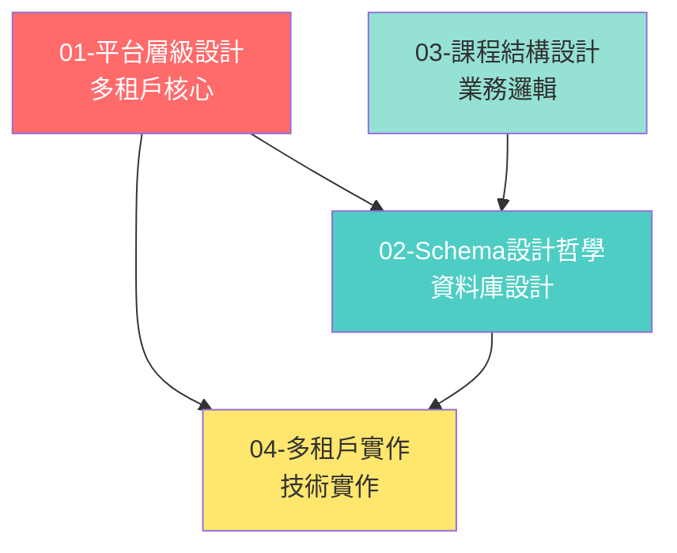

# 平台架構總覽

> 通用教育平台架構設計文件
> 記錄日期：2026-02-13
> 整合來源：BUSINESS_LOGIC_DECISIONS.md + SCHEMA_DESIGN_DECISIONS.md + LMS_EXTENDED_SYSTEMS.md

---

## 📚 文件導航

### 🏛️ 核心架構決策

| 文件 | 說明 | 關鍵內容 |
|------|------|---------|
| [01-平台層級設計.md](./01-平台層級設計.md) | **多租戶核心架構** | 機構 → 學校 → 班級層級設計 |
| [02-Schema設計哲學.md](./02-Schema設計哲學.md) | **資料庫設計決策** | 混合設計：傳統表 + 節點樹 |
| [03-課程結構設計.md](./03-課程結構設計.md) | **課程與知識樹** | 複製流程、版本控制、作業派發 |
| [04-多租戶實作.md](./04-多租戶實作.md) | **多租戶技術實作** | RLS、權限分級、資料隔離 |

---

## 🎯 核心架構原則

### 1. 多租戶 SaaS 架構（規模化關鍵）

```
平台層（Platform）
    │
    └─ 機構層（Organizations）← 多租戶隔離點
           │
           ├─ 機構 A（台北市教育局）
           │      ├─ 學校 A1（中正國小）
           │      │      └─ 班級
           │      └─ 學校 A2（信義國小）
           │
           └─ 機構 B（康橋教育集團）
                  ├─ 學校 B1（新竹校區）
                  └─ 學校 B2（青山校區）
```

**為何重要**：
- ✅ 支援從單校到大型機構的擴展
- ✅ 資料完全隔離（機構間零洩漏）
- ✅ 靈活商業模式（按機構/學校/學生計費）

---

### 2. 混合 Schema 設計（穩定 + 彈性）

**組織架構**（穩定）→ **傳統分離表**
```sql
organizations → schools → classrooms
```
- 類型安全、查詢高效
- 關聯清晰、易於管理

**課程結構**（彈性）→ **統一節點樹**
```sql
course_nodes (ltree)
  - parent_id + path
  - metadata (JSONB)
```
- 完全彈性、可自由擴展
- Notion-like 階層體驗

---

### 3. 課程分層複製機制

```
官方課程（Platform）
    ↓ 複製（參照 + 可同步）
機構課程庫（Organization）
    ↓ 複製
校級課程庫（School）
    ↓ 複製
班級課程（Classroom）
    ↓ 選取模組 + 派發
作業（Assignment）
```

**核心特性**：
- 每層複製後獨立（最大彈性）
- 保留來源追蹤（source_template_id + version）
- 可選擇性同步更新（非強制）

---

## 🔍 快速查找指南

### 按問題查找

| 我想知道... | 查看文件 | 關鍵章節 |
|-----------|---------|---------|
| 如何設計多租戶隔離？ | 04-多租戶實作 | Row Level Security 設計 |
| 課程如何分層複製？ | 03-課程結構設計 | 課程複製流程 |
| 為何用混合設計？ | 02-Schema設計哲學 | 混合設計決策對比 |
| 機構/學校/班級關係？ | 01-平台層級設計 | 層級架構圖 |
| 老師如何分享課程？ | 03-課程結構設計 | 老師間分享機制 |
| 學生可以自學嗎？ | 03-課程結構設計 | 混合學習模式 |
| 作業和課程的關係？ | 03-課程結構設計 | 作業是課程子集 |
| 知識樹怎麼設計？ | 03-課程結構設計 | Notion-like 知識樹 |
| 如何管理機構權限？ | 04-多租戶實作 | 權限分級管理 |
| 跨校數據怎麼查？ | 04-多租戶實作 | 機構級儀表板 |

---

### 按角色查找

#### 產品經理 / 需求方
- 先看：[01-平台層級設計](./01-平台層級設計.md) - 理解整體架構
- 再看：[03-課程結構設計](./03-課程結構設計.md) - 理解功能邏輯

#### 架構師 / 技術主管
- 先看：[02-Schema設計哲學](./02-Schema設計哲學.md) - 理解設計決策
- 再看：[04-多租戶實作](./04-多租戶實作.md) - 理解技術實作

#### 後端工程師
- 先看：[04-多租戶實作](./04-多租戶實作.md) - 實作 RLS 和權限
- 再看：[02-Schema設計哲學](./02-Schema設計哲學.md) - 實作 Schema

#### 前端工程師
- 先看：[01-平台層級設計](./01-平台層級設計.md) - 理解角色權限
- 再看：[03-課程結構設計](./03-課程結構設計.md) - 理解業務流程

---

## 📊 架構關係圖



**說明**：
- **紅色**（平台層級）：最高優先級，定義整體架構
- **青色**（Schema設計）：技術實作基礎
- **綠色**（課程結構）：業務邏輯核心
- **黃色**（多租戶實作）：規模化關鍵技術

---

## 🎯 設計原則總結

### 核心原則

1. **最小依賴、最大彈性**
   - 每一層複製後獨立，避免連動影響
   - 老師可自由調整課程內容

2. **保留追蹤能力**
   - source_template_id + source_version 可追溯來源
   - 官方更新時可選擇性同步

3. **多租戶完全隔離**
   - 機構間資料零洩漏
   - Row Level Security 確保安全

4. **支援多元使用情境**
   - 班級教學 + 個人自學並存
   - 單校 → 連鎖機構 → 教育局都適用

---

### 命名規範

| 概念 | 正確命名 | 錯誤命名 | 原因 |
|------|---------|---------|------|
| 班級 | `classrooms` | `classes` | 避免程式語言保留字 |
| 班級 ID | `classroom_id` | `class_id` | 保持一致性 |
| 機構 | `organizations` | `orgs` | 完整清晰 |
| 課程節點 | `course_nodes` | `nodes` | 明確用途 |

---

## 🔄 文件變更記錄

| 日期 | 變更內容 | 變更者 |
|------|---------|--------|
| 2026-02-13 | 初版建立，整合原架構決策文件 | Young Tsai |
| 2026-02-13 | 建立獨立架構資料夾 `平台架構設計/` | Young Tsai |

---

## 📝 常見問題（FAQ）

### Q1: 如果官方課程更新了，已經派發的作業會受影響嗎？
**A**: 不會。作業是「快照」（snapshot），派發時就凍結內容，不會被後續更新影響。

### Q2: 如果學生在自學區選了一個課程，老師看得到進度嗎？
**A**: 看得到。學生活動表會記錄所有學習活動，但自學活動標記為 `teacher_assigned = false`。

### Q3: 王老師分享課程給李老師後，王老師修改課程，李老師的版本會跟著改嗎？
**A**: 不會。李老師複製的是獨立副本，兩者完全獨立。

### Q4: 如果一個課程包含 10 個模組，老師只想派其中 3 個當作業，其他 7 個怎麼辦？
**A**: 作業表的 `selected_modules` 欄位只記錄這 3 個模組的 ID，學生只需完成這 3 個即可。

### Q5: 機構 A 可以看到機構 B 的資料嗎？
**A**: 完全不行。多租戶隔離確保機構間資料零洩漏，Row Level Security 在資料庫層強制隔離。

### Q6: 如何支援單一學校使用？
**A**: 單一學校可建立機構（機構 = 學校，一對一關係），架構完全適用。

---

## 🚀 下一步

### 實作優先順序

#### Phase 0：核心架構（必須優先）
- ✅ 多租戶架構設計（本資料夾文件）
- ⏳ 資料庫 Schema 實作
- ⏳ Row Level Security (RLS) 設定
- ⏳ 基礎權限系統

#### Phase 1：MVP 核心功能
- ⏳ 課程複製機制
- ⏳ 作業派發系統
- ⏳ 學生學習路徑（班級作業 + 自學）

#### Phase 2：進階功能
- ⏳ 版本追蹤與同步
- ⏳ 老師間分享機制
- ⏳ 機構級儀表板

---

## 📚 相關文件

### 本架構資料夾
- [01-平台層級設計.md](./01-平台層級設計.md)
- [02-Schema設計哲學.md](./02-Schema設計哲學.md)
- [03-課程結構設計.md](./03-課程結構設計.md)
- [04-多租戶實作.md](./04-多租戶實作.md)

### 功能設計
- [../features/README.md](../features/README.md) - 功能系統總覽

### 開發文件
- [../../docs/development/TECHNICAL_DECISION.md](../../docs/development/TECHNICAL_DECISION.md) - 技術選型
- [../../docs/development/DEVELOPMENT_GUIDE.md](../../docs/development/DEVELOPMENT_GUIDE.md) - 開發指南

---

**文件用途**：
此資料夾作為教育平台架構設計的核心文件，所有 Schema 設計、API 設計、UI 設計都應該遵循這些架構決策。未來如有調整，需更新相應文件並記錄變更理由。
