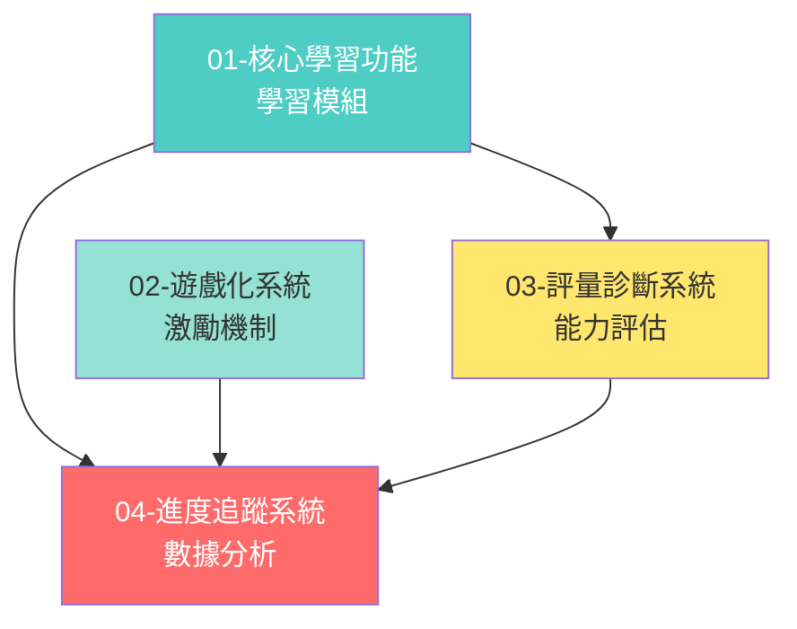

# 功能系統總覽

> 記錄日期：2026-02-13
> 來源：LMS_EXTENDED_SYSTEMS.md 系統 1-5, 7
> 用途：擴展功能設計指南

---

## 📚 文件導航

### 🎯 核心功能文件

| 文件 | 說明 | 實作階段 |
|------|------|---------|
| [01-核心學習功能.md](./01-核心學習功能.md) | **學習模組設計** | Phase 1 (MVP) |
| [02-遊戲化系統.md](./02-遊戲化系統.md) | **遊戲化機制** | Phase 1-2 |
| [03-評量診斷系統.md](./03-評量診斷系統.md) | **診斷評量與 MTSS** | Phase 2 |
| [04-進度追蹤系統.md](./04-進度追蹤系統.md) | **學習進度與分析** | Phase 1-2 |

---

## 🎯 功能分層策略

### Phase 1（MVP 核心功能）

**目標**：建立可用的學習平台

#### 核心學習功能
- ✅ 朗讀練習（STT + AI 評分）
- ✅ 生字詞學習（筆順、部件拆解）
- ✅ 作業派發與批改

#### 基礎遊戲化
- ✅ 點數系統（XP）
- ✅ 等級系統（LV 1-100）
- ✅ 簡單徽章（完成里程碑）

#### 基礎進度追蹤
- ✅ 作業完成率
- ✅ 學習時長統計
- ✅ 簡單能力評估

**預估工時**：8-12 週

---

### Phase 2（進階功能）

**目標**：增強學習體驗與動機

#### 完整遊戲化
- ⏳ 挑戰系統（每日/週任務）
- ⏳ 排行榜（班級/學校）
- ⏳ 虛擬道具與寶箱

#### 診斷評量
- ⏳ 入學診斷（Baseline Assessment）
- ⏳ 形成性評量（Formative Assessment）
- ⏳ 錯誤分析與補救

#### 能力追蹤
- ⏳ 五大能力維度（聲韻、識字、流暢、詞彙、理解）
- ⏳ 能力雷達圖
- ⏳ 成長曲線分析

**預估工時**：8-10 週

---

### Phase 3（完整系統）

**目標**：提供專業教學支援

#### MTSS-R 多層次支持
- 🔍 Tier 1：全班核心教學
- 🔍 Tier 2：小組補救教學
- 🔍 Tier 3：密集個別介入

#### 蘇格拉底對話
- 🔍 AI 對話式閱讀理解
- 🔍 開放式問答評估

#### 認證系統
- 🔍 能力認證（注音達人、朗讀流利等）
- 🔍 數位證書生成

**預估工時**：6-8 週

---

## 🔍 快速查找指南

### 按功能類型查找

| 我想實作... | 查看文件 | 關鍵章節 |
|-----------|---------|---------|
| 朗讀練習 STT 評分 | 01-核心學習功能 | 朗讀模組設計 |
| 生字筆順練習 | 01-核心學習功能 | 生字詞模組設計 |
| 點數與等級系統 | 02-遊戲化系統 | 點數系統、等級系統 |
| 徽章系統 | 02-遊戲化系統 | 徽章系統設計 |
| 排行榜 | 02-遊戲化系統 | 排行榜設計 |
| 入學診斷測驗 | 03-評量診斷系統 | 診斷評量 |
| 能力雷達圖 | 04-進度追蹤系統 | 能力成長追蹤 |
| 學習歷程記錄 | 04-進度追蹤系統 | 學習活動日誌 |
| 早期介入預警 | 03-評量診斷系統 | MTSS-R 框架 |

---

### 按角色查找

#### 產品經理
- 先看：[README.md](./README.md) - 理解功能優先順序
- 再看：[01-核心學習功能.md](./01-核心學習功能.md) - 理解核心價值

#### 後端工程師
- 先看：[01-核心學習功能.md](./01-核心學習功能.md) - 學習模組 API
- 再看：[02-遊戲化系統.md](./02-遊戲化系統.md) - 遊戲化資料結構
- 最後：[04-進度追蹤系統.md](./04-進度追蹤系統.md) - 統計與追蹤

#### 前端工程師
- 先看：[01-核心學習功能.md](./01-核心學習功能.md) - 學習介面設計
- 再看：[02-遊戲化系統.md](./02-遊戲化系統.md) - 遊戲化 UI
- 最後：[04-進度追蹤系統.md](./04-進度追蹤系統.md) - 儀表板設計

#### AI/ML 工程師
- 先看：[01-核心學習功能.md](./01-核心學習功能.md) - STT 與 AI 評分
- 再看：[03-評量診斷系統.md](./03-評量診斷系統.md) - 診斷與補救

---

## 📊 功能關係圖



**說明**：
- **青色**（核心學習）：基礎功能，所有其他功能的基礎
- **綠色**（遊戲化）：激勵機制，提升參與度
- **黃色**（評量診斷）：能力評估，支援教學決策
- **紅色**（進度追蹤）：數據中心，整合所有學習數據

---

## 🎯 設計原則

### 1. 教育為本、技術為輔

**原則**：
- ✅ 所有功能都服務於教學目標
- ✅ 遊戲化不能影響學習效果
- ✅ 數據分析要能指導教學

**反例**：
- ❌ 為了遊戲化而遊戲化（無意義的積分）
- ❌ 數據好看但對教學無幫助

---

### 2. 漸進式實作

**原則**：
- ✅ Phase 1 先建立可用的核心功能
- ✅ Phase 2 再增強體驗與動機
- ✅ Phase 3 提供專業教學支援

**好處**：
- 快速驗證核心假設
- 及早獲得用戶反饋
- 降低開發風險

---

### 3. 資料驅動決策

**原則**：
- ✅ 所有學習活動都留下數據
- ✅ 數據要能支援教學決策
- ✅ 保護學生隱私

**資料分層**：
```
學生個人數據 → 班級統計 → 學校統計 → 機構統計
（最細緻）                            （最粗略）
```

---

### 4. 符合教育科學

**原則**：
- ✅ 遵循「閱讀科學」（Science of Reading）
- ✅ 支援 MTSS-R 框架（多層次支持）
- ✅ 形成性評量與總結性評量並重

**參考文件**：
- `../../docs/references/science-of-reading.md`
- `../../docs/PEDAGOGY.md`

---

## 📋 功能清單總覽

### 核心學習功能（01）

| 功能 | 說明 | Phase | 優先級 |
|------|------|-------|-------|
| 朗讀練習 | STT + AI 評分 | 1 | P0 |
| 生字詞學習 | 筆順、部件拆解 | 1 | P0 |
| 閱讀理解測驗 | 選擇題、問答題 | 1 | P1 |
| 蘇格拉底對話 | AI 對話式理解 | 3 | P2 |

---

### 遊戲化系統（02）

| 功能 | 說明 | Phase | 優先級 |
|------|------|-------|-------|
| 點數系統 | XP/Coins/Stars | 1 | P1 |
| 等級系統 | LV 1-100 | 1 | P1 |
| 徽章系統 | 進度/能力/挑戰徽章 | 2 | P1 |
| 排行榜 | 班級/學校排名 | 2 | P2 |
| 任務與挑戰系統 | 每日/週/挑戰/成就 | 2 | P2 |
| 虛擬道具 | 寶箱、加速卡等 | 2 | P3 |

---

### 評量診斷系統（03）

| 功能 | 說明 | Phase | 優先級 |
|------|------|-------|-------|
| 入學診斷 | Baseline Assessment | 2 | P1 |
| 形成性評量 | 即時回饋 | 1 | P0 |
| 總結性評量 | 單元/期末測驗 | 2 | P1 |
| 錯誤分析 | 自動補救推薦 | 2 | P1 |
| MTSS Tier 1 | 全班核心教學 | 2 | P1 |
| MTSS Tier 2 | 小組補救 | 3 | P2 |
| MTSS Tier 3 | 個別介入 | 3 | P2 |

---

### 進度追蹤系統（04）

| 功能 | 說明 | Phase | 優先級 |
|------|------|-------|-------|
| 即時進度監控 | 作業完成率 | 1 | P0 |
| 學習時長統計 | 累積學習時間 | 1 | P1 |
| 能力雷達圖 | 五大能力維度 | 2 | P1 |
| 成長曲線 | 能力成長趨勢 | 2 | P1 |
| 學習活動日誌 | 完整學習記錄 | 1 | P0 |
| 家長週報/月報 | 自動生成報告 | 2 | P2 |

**優先級說明**：
- **P0**：MVP 必須（Phase 1）
- **P1**：重要功能（Phase 1-2）
- **P2**：進階功能（Phase 2-3）
- **P3**：加分功能（Phase 3+）

---

## 🔗 與架構文件的關聯

### 依賴架構決策

所有功能設計都基於以下架構決策：

1. **多租戶隔離** → 所有功能表都需要 `organization_id`
2. **混合 Schema** → 課程相關功能使用 `course_nodes`
3. **課程複製機制** → 功能需支援不同層級的課程
4. **作業是課程子集** → 學習活動關聯到模組而非課程

**參考**：
- [../architecture/01-平台層級設計.md](../architecture/01-平台層級設計.md)
- [../architecture/02-Schema設計哲學.md](../architecture/02-Schema設計哲學.md)
- [../architecture/03-課程結構設計.md](../architecture/03-課程結構設計.md)

---

### 資料隔離要求

所有功能都必須遵循多租戶隔離原則：

```sql
-- 範例：遊戲化積分表也需要租戶隔離
student_points:
  - point_id
  - student_id
  - organization_id ← 必須
  - amount
  - source
  - earned_at
```

**參考**：
- [../architecture/04-多租戶實作.md](../architecture/04-多租戶實作.md)

---

## 📚 相關文件

### 本功能資料夾
- [01-核心學習功能.md](./01-核心學習功能.md)
- [02-遊戲化系統.md](./02-遊戲化系統.md)
- [03-評量診斷系統.md](./03-評量診斷系統.md)
- [04-進度追蹤系統.md](./04-進度追蹤系統.md)

### 架構文件
- [../architecture/README.md](../architecture/README.md) - 架構總覽

### 開發文件
- [../../docs/development/TECHNICAL_DECISION.md](../../docs/development/TECHNICAL_DECISION.md) - 技術選型
- [../../docs/development/DEVELOPMENT_GUIDE.md](../../docs/development/DEVELOPMENT_GUIDE.md) - 開發指南

### 教育理論
- [../../docs/PEDAGOGY.md](../../docs/PEDAGOGY.md) - 教學法
- [../../docs/references/science-of-reading.md](../../docs/references/science-of-reading.md) - 閱讀科學

---

## 🔄 變更記錄

| 日期 | 變更內容 | 變更者 |
|------|---------|--------|
| 2026-02-13 | 初版建立，整合 LMS_EXTENDED_SYSTEMS.md | Young Tsai |

---

**文件用途**：
此資料夾包含平台所有擴展功能的設計文件，定義遊戲化、評量、追蹤等系統的實作細節。與架構文件共同構成完整的技術設計文件。
